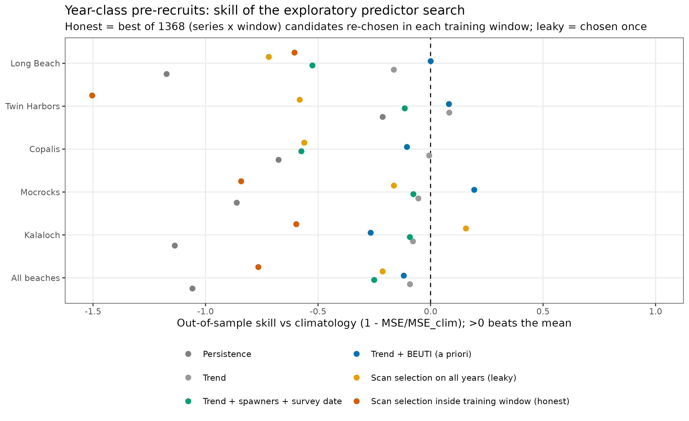
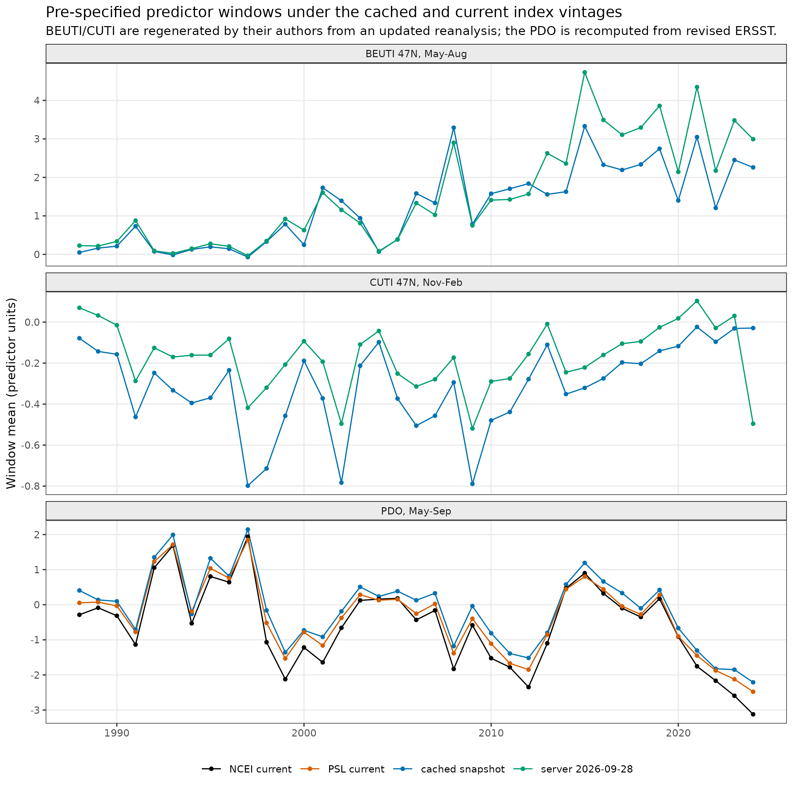
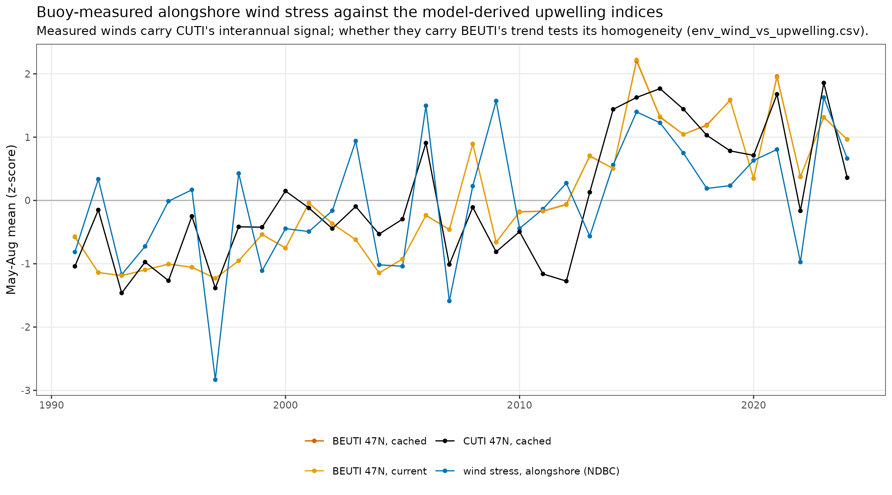

# Razor clam recruitment re-analysis: results report

*Generated 2026-10-02 19:46 by `01_code/R/10_report.R` at commit `583c5a6`. Every figure and table below is regenerated by `Rscript 01_code/R/run_all.R`; methods are described in `docs/methodology-review.md` and the manuscript draft in `manuscript/manuscript.md`.*

```
run_all.R  2026-10-02 19:46:28
commit     583c5a6 (uncommitted changes present)
args       (none)
out        /home/user/razor-clam-recruitment-analysis/03_analyses/robust-reanalysis
surrogates 2000
vintage    current
R          4.3.3
total      130 s (before the report step)

01  01_build_datasets.R                15 s  ok
02  02_cohort_diagnostics.R             8 s  ok
03  03_null_audit.R                    13 s  ok
04  04_confirmatory_models.R            4 s  ok
05  05_window_scan.R                    9 s  ok
06  06_forecast_skill.R                52 s  ok
07  07_figures_overview.R               2 s  ok
08  08_forecast_protocol.R              0 s  ok
09  09_env_record_diagnostics.R        27 s  ok
```

## Key results

- **Survey timing.** Median survey date ranges from 06 Jun (Long Beach) to 09 Aug (Twin Harbors); significant drift (p < 0.05) at 3 of 5 beaches.
- **Cohort linkage.** Pre-recruits at survey t predict recruits at t+1 at 4 of 5 beaches (r = -0.16 to 0.58).
- **Original screen vs chance.** 83 of 900 cells have p < 0.05; the surrogate null gives a median of 60 (95th percentile 85), global p = 0.07; 4 cells survive BH-FDR at q < 0.05.
- **BEUTI (May-Aug Y) on pre-recruits of year class Y.** Pooled LMM: -0.31 (-0.67 to 0.06) per SD, LRT p = 0.111, Holm p = 1.00; excluding Kalaloch: -0.45, Holm p = 0.138; coastwide index GLS-AR(1): -0.62 +/- 0.20 SD, Holm p = 0.052.
- **Other pre-specified predictors of pre-recruits.** None approach significance (smallest p = 0.50).
- **Recruits at Y+2.** Only Columbia freshet discharge is nominally associated: 0.18 (0.05 to 0.32), p = 0.011, Holm p = 0.11.
- **Calibrated search over every series and window.** 3312 windows tested; 0 pass family-wise control (95th percentile of the null max |r|: pre 0.67, rec 0.72). Strongest windows: pre: BEUTI Apr Y-1 - Jul Y-1 (r = 0.55, family-wise p = 0.58); rec: Wave energy Hs^2 (buoys) Jul Y - Aug Y (r = -0.60, family-wise p = 0.63).
- **Out-of-sample skill of the search (year-class pre-recruits, vs climatology).** Honest selection -0.77; leaky selection -0.21; trend + BEUTI (a priori) -0.12; trend alone -0.09. The honest search chose SST anomaly (buoys) at 6 of 13 training origins.
- **Index vintage.** BEUTI/CUTI/PDO: current (see env_index_vintages).
- **Forecast skill vs climatology.** Pre-recruits: leaky selection 0.31 vs honest selection -0.20. Recruits: leaky 0.30, honest -0.20, stock carry-over (no environment) 0.24.
- **SST construction.** Alternative regional anomaly constructions agree at r = 0.88 to 1.00 monthly.
- **Legacy station blend.** Largest era-mean offset of the legacy blended series from the homogenised anomaly: 0.92 deg C (Kalaloch, LAPW1 La Push).
- **BEUTI homogeneity.** At 47N the May-Aug BEUTI trend is 0.53 per decade; a 2011 level shift of 1.16 (p = 0.03) after allowing for the trend; best single breakpoint 2013.

## Figures

### Figure 1: fig_study_area


Study area: management beaches (red), open-coast buoys used for the regional SST anomaly (triangles), and the 46N / 47N upwelling-index latitude bins.

### Figure 2: fig_abundance_timeseries


Estimated abundance of pre-recruits (<76 mm) and recruits (>=76 mm) by beach and survey year (log scale).

### Figure 3: fig_predictor_timeseries


The five pre-specified cohort-aligned predictors with linear trends.

### Figure 4: fig_survey_timing


Median stock-assessment survey date by beach and year (crosses: imputed).

### Figure 5: fig_length_frequency


Length-frequency distributions by beach and survey timing; a <=20 mm settler mode appears only in surveys after mid-July.

### Figure 6: fig_cohort_linkage


Log pre-recruits at survey t versus log recruits at survey t+1.

### Figure 7: fig_null_audit


Largest |r| in the original 90-cell screening grid per beach and size class (red) against phase-randomised surrogates (grey).

### Figure 8: fig_confirmatory_forest


Pre-specified predictor effects (per SD, 95% CI) on pre-recruits of year class Y at survey Y+1 and recruits at Y+2, under three specifications.

### Figure 9: fig_beach_heterogeneity


Beach-specific GLS-AR(1) estimates for the same predictors.

### Figure 10: fig_window_scan_pre


Exploratory window scan for pre-recruits: detrended r of every 1-4 month window with the coastwide year-class index; outlined cells would pass family-wise control.

### Figure 11: fig_window_scan_rec


Exploratory window scan for recruits (same conventions).

### Figure 12: fig_forecast_skill


Rolling-origin forecast skill versus climatology: leaky vs honest predictor selection, persistence, stock carry-over.

### Figure 13: fig_forecast_skill_cohort



Year-class pre-recruits: out-of-sample skill of the exploratory predictor search (honest vs leaky selection) against trend and a priori models.

### Figure 14: fig_env_coverage


Coverage of every environmental source by year-month; the clam survey period is boxed.

### Figure 15: fig_legacy_idw_vs_homogenized


The legacy notebook's station-blended beach temperature (points, coloured by dominant station) against the homogenised regional anomaly (line).

### Figure 16: fig_sst_homogenization


The regional SST anomaly under four constructions, with +/- 2 SE of the pipeline series.

### Figure 17: fig_beuti_homogeneity


May-Aug BEUTI, CUTI and their ratio at 46N and 47N, with the 2010/2011 source-model boundary marked.

### Figure 18: fig_index_vintages



The pre-specified BEUTI, CUTI and PDO windows under the cached snapshots and the current server files.

### Figure 19: fig_wind_vs_upwelling



Buoy-measured alongshore wind stress (May-Aug) against CUTI and BEUTI at 47N, all as z-scores.

## Tables

### abundance_summary

Median, range and SD of log abundance by beach and size class. Source: `tables/abundance_summary.csv`.

| beach | series | n_years | first | last | median_millions | min_millions | max_millions | max_min_ratio | sd_log |
|---|---|---|---|---|---|---|---|---|---|
| Kalaloch | pre_recruits | 28 | 1997 | 2024 | 3.19 | 0.0743 | 100 | 1350 | 1.75 |
| Kalaloch | recruits | 28 | 1997 | 2024 | 1.17 | 0.192 | 6.18 | 32.1 | 0.953 |
| Mocrocks | pre_recruits | 28 | 1997 | 2024 | 6.98 | 0.975 | 48.2 | 49.4 | 0.766 |
| Mocrocks | recruits | 28 | 1997 | 2024 | 5.28 | 2.5 | 11.9 | 4.77 | 0.455 |
| Copalis | pre_recruits | 28 | 1997 | 2024 | 6.82 | 0.608 | 17.5 | 28.7 | 0.773 |
| Copalis | recruits | 28 | 1997 | 2024 | 5.82 | 1.18 | 16.5 | 14 | 0.571 |
| Twin Harbors | pre_recruits | 28 | 1997 | 2024 | 3.1 | 1.39 | 16.3 | 11.7 | 0.665 |
| Twin Harbors | recruits | 28 | 1997 | 2024 | 3.46 | 1.68 | 8.53 | 5.08 | 0.385 |
| Long Beach | pre_recruits | 28 | 1997 | 2024 | 10 | 0.192 | 39.1 | 204 | 1.43 |
| Long Beach | recruits | 28 | 1997 | 2024 | 5.79 | 2.08 | 24.8 | 11.9 | 0.653 |

### survey_timing_by_beach

Median and SD of survey day of year; trend in days per year. Source: `tables/survey_timing_by_beach.csv`.

| beach | median_doy | sd_doy | slope_days_per_yr | p | n_years |
|---|---|---|---|---|---|
| Kalaloch | 205 | 14.3 | -1.32 | 0.000000532 | 29 |
| Mocrocks | 199 | 5.28 | -0.195 | 0.0975 | 29 |
| Copalis | 168 | 16.7 | 1.41 | 0.0000157 | 28 |
| Twin Harbors | 221 | 9.37 | -0.825 | 0.0000029 | 29 |
| Long Beach | 157 | 12.2 | -0.31 | 0.261 | 29 |

### prerecruit_lt30_share_by_timing

Share of pre-recruits <20 mm and <30 mm by survey-timing class. Source: `tables/prerecruit_lt30_share_by_timing.csv`.

| timing | n | share_pre_lt20mm | share_pre_lt30mm |
|---|---|---|---|
| before 15 Jun | 37259 | 0.137 | 0.322 |
| 15 Jun - 15 Jul | 47891 | 0.0854 | 0.208 |
| after 15 Jul | 50164 | 0.219 | 0.301 |

### cohort_linkage

Correlations linking pre-recruits and recruits across consecutive surveys. Source: `tables/cohort_linkage.csv`.

| beach | r_pre_t_rec_t1 | p_pre_t_rec_t1 | r_pre_t_rec_t | r_rec_t_rec_t1 | r_pre_t_pre_t1 | n |
|---|---|---|---|---|---|---|
| Kalaloch | 0.513 | 0.0062 | 0.00671 | 0.00643 | 0.0355 | 27 |
| Mocrocks | 0.496 | 0.00849 | 0.176 | 0.602 | -0.0957 | 27 |
| Copalis | 0.58 | 0.00152 | 0.282 | 0.528 | -0.0101 | 27 |
| Twin Harbors | -0.158 | 0.433 | -0.237 | 0.305 | 0.218 | 27 |
| Long Beach | 0.496 | 0.00853 | 0.398 | 0.558 | 0.0247 | 27 |

### synchrony_prerecruits

Cross-beach correlation matrix, log pre-recruits. Source: `tables/synchrony_prerecruits.csv`.

| beach | Kalaloch | Mocrocks | Copalis | Twin Harbors | Long Beach |
|---|---|---|---|---|---|
| Kalaloch | 1 | 0.393 | 0.463 | -0.0621 | 0.194 |
| Mocrocks | 0.393 | 1 | 0.547 | 0.231 | 0.222 |
| Copalis | 0.463 | 0.547 | 1 | 0.308 | 0.295 |
| Twin Harbors | -0.0621 | 0.231 | 0.308 | 1 | 0.168 |
| Long Beach | 0.194 | 0.222 | 0.295 | 0.168 | 1 |

### synchrony_recruits

Cross-beach correlation matrix, log recruits. Source: `tables/synchrony_recruits.csv`.

| beach | Kalaloch | Mocrocks | Copalis | Twin Harbors | Long Beach |
|---|---|---|---|---|---|
| Kalaloch | 1 | 0.0769 | 0.245 | 0.0717 | 0.227 |
| Mocrocks | 0.0769 | 1 | 0.71 | 0.669 | 0.624 |
| Copalis | 0.245 | 0.71 | 1 | 0.584 | 0.772 |
| Twin Harbors | 0.0717 | 0.669 | 0.584 | 1 | 0.66 |
| Long Beach | 0.227 | 0.624 | 0.772 | 0.66 | 1 |

### synchrony_summary

Mean cross-beach correlation, raw and detrended, with and without Kalaloch. Source: `tables/synchrony_summary.csv`.

| series | detrended | mean_r_all | mean_r_excl_kalaloch | mean_r_kalaloch_vs_others |
|---|---|---|---|---|
| pre_recruits | FALSE | 0.276 | 0.295 | 0.247 |
| pre_recruits | TRUE | 0.32 | 0.355 | 0.266 |
| recruits | FALSE | 0.464 | 0.67 | 0.155 |
| recruits | TRUE | 0.432 | 0.511 | 0.315 |

### trends

GLS-AR(1) linear trends of log abundance and of predictors. Source: `tables/trends.csv`.

| beach | series | slope_per_yr | se | p | phi |
|---|---|---|---|---|---|
| Kalaloch | pre_recruits | 0.0605 | 0.0373 | 0.117 | -0.0807 |
| Kalaloch | recruits | -0.0188 | 0.0222 | 0.405 | -0.0129 |
| Mocrocks | pre_recruits | 0.0143 | 0.0158 | 0.374 | -0.147 |
| Mocrocks | recruits | 0.0387 | 0.0101 | 0.000739 | 0.287 |
| Copalis | pre_recruits | 0.0233 | 0.0167 | 0.174 | -0.0777 |
| Copalis | recruits | 0.0452 | 0.0132 | 0.00203 | 0.249 |
| Twin Harbors | pre_recruits | -0.0401 | 0.0135 | 0.00622 | -0.0253 |
| Twin Harbors | recruits | 0.024 | 0.00837 | 0.00801 | 0.0709 |
| Long Beach | pre_recruits | 0.015 | 0.0345 | 0.668 | 0.0196 |
| Long Beach | recruits | 0.0389 | 0.0198 | 0.0607 | 0.428 |
| Copalis | beuti_larval | 0.135 | 0.0184 | 0.0000000888 | -0.0281 |
| Copalis | cuti_winter | 0.00972 | 0.00351 | 0.0103 | 0.127 |
| Copalis | pdo_larval | -0.054 | 0.0428 | 0.218 | 0.557 |
| Copalis | q_freshet | -37.8 | 57.5 | 0.517 | 0.24 |
| Copalis | sst_larval | 0.0311 | 0.0143 | 0.0385 | 0.0949 |
| Long Beach | beuti_larval | 0.0832 | 0.0106 | 0.0000000251 | -0.221 |
| Long Beach | cuti_winter | -0.00232 | 0.00307 | 0.457 | 0.0235 |
| Long Beach | pdo_larval | -0.054 | 0.0428 | 0.218 | 0.557 |
| Long Beach | q_freshet | -37.8 | 57.5 | 0.517 | 0.24 |
| Long Beach | sst_larval | 0.0311 | 0.0143 | 0.0385 | 0.0949 |

### null_audit_reproduction_check

Agreement of the re-implemented screening grid with the committed legacy workbook. Source: `tables/null_audit_reproduction_check.csv`.

| cells_matched | max_abs_diff_r |
|---|---|
| 900 | 0.0005 |

### null_audit_global

Observed vs surrogate-null count of p<0.05 cells; BH-FDR counts. Source: `tables/null_audit_global.csv`.

| cells | observed_sig_p05 | naive_expected | null_median | null_95 | p_global | bh_q05 | bh_q10 |
|---|---|---|---|---|---|---|---|
| 900 | 83 | 45 | 60 | 85 | 0.0715 | 4 | 5 |

### null_audit_by_series

Per beach x size class: observed max|r|, null quantiles, family-wise p. Source: `tables/null_audit_by_series.csv`.

| series | beach | resp | cells | obs_max_abs_r | obs_n_sig | null_max_abs_r_median | null_max_abs_r_95 | null_n_sig_median | null_n_sig_95 | fwer_p_max_abs_r | p_n_sig |
|---|---|---|---|---|---|---|---|---|---|---|---|
| Kalaloch\|Pre | Kalaloch | Pre | 90 | 0.598 | 9 | 0.515 | 0.632 | 6 | 12 | 0.11 | 0.191 |
| Kalaloch\|Rec | Kalaloch | Rec | 90 | 0.493 | 2 | 0.507 | 0.623 | 5 | 10 | 0.588 | 0.922 |
| Mocrocks\|Pre | Mocrocks | Pre | 90 | 0.498 | 4 | 0.477 | 0.587 | 3 | 7 | 0.364 | 0.457 |
| Mocrocks\|Rec | Mocrocks | Rec | 90 | 0.739 | 20 | 0.574 | 0.717 | 10 | 20 | 0.023 | 0.0705 |
| Copalis\|Pre | Copalis | Pre | 90 | 0.51 | 2 | 0.49 | 0.613 | 4 | 8 | 0.402 | 0.886 |
| Copalis\|Rec | Copalis | Rec | 90 | 0.593 | 20 | 0.546 | 0.669 | 8 | 16 | 0.264 | 0.012 |
| Twin Harbors\|Pre | Twin Harbors | Pre | 90 | 0.679 | 3 | 0.617 | 0.743 | 5 | 9 | 0.208 | 0.839 |
| Twin Harbors\|Rec | Twin Harbors | Rec | 90 | 0.616 | 4 | 0.642 | 0.768 | 6 | 13 | 0.638 | 0.858 |
| Long Beach\|Pre | Long Beach | Pre | 90 | 0.547 | 3 | 0.476 | 0.599 | 3 | 7 | 0.162 | 0.601 |
| Long Beach\|Rec | Long Beach | Rec | 90 | 0.581 | 16 | 0.551 | 0.68 | 9 | 18 | 0.352 | 0.102 |

### null_audit_all_cells

All 900 screening cells (sorted by p). Source: `tables/null_audit_all_cells.csv`.

| series | beach | resp | lag | pred | metric | window | r | n | p | q_bh |
|---|---|---|---|---|---|---|---|---|---|---|
| Mocrocks\|Rec | Mocrocks | Rec | 5 | BEUTI_Larval | BEUTI | Larval | 0.739 | 28 | 0.000007 | 0.0063 |
| Mocrocks\|Rec | Mocrocks | Rec | 3 | BEUTI_Settle | BEUTI | Settle | 0.731 | 27 | 0.0000148 | 0.00667 |
| Mocrocks\|Rec | Mocrocks | Rec | 2 | BEUTI_Settle | BEUTI | Settle | 0.676 | 27 | 0.000108 | 0.0323 |
| Mocrocks\|Rec | Mocrocks | Rec | 1 | BEUTI_Settle | BEUTI | Settle | 0.657 | 27 | 0.000198 | 0.0446 |
| Mocrocks\|Rec | Mocrocks | Rec | 4 | BEUTI_Settle | BEUTI | Settle | 0.642 | 27 | 0.000302 | 0.0544 |
| Mocrocks\|Rec | Mocrocks | Rec | 3 | BEUTI_Larval | BEUTI | Larval | 0.589 | 28 | 0.000971 | 0.126 |
| Kalaloch\|Pre | Kalaloch | Pre | 2 | Discharge_Larval | Discharge | Larval | -0.598 | 27 | 0.000987 | 0.126 |
| Copalis\|Rec | Copalis | Rec | 4 | BEUTI_Settle | BEUTI | Settle | 0.593 | 27 | 0.00112 | 0.126 |
| Mocrocks\|Rec | Mocrocks | Rec | 5 | BEUTI_Spawn | BEUTI | Spawn | 0.577 | 28 | 0.00129 | 0.129 |
| Long Beach\|Rec | Long Beach | Rec | 0 | Discharge_Spring | Discharge | Spring | -0.581 | 27 | 0.00149 | 0.134 |
| Mocrocks\|Rec | Mocrocks | Rec | 4 | BEUTI_Larval | BEUTI | Larval | 0.567 | 28 | 0.00167 | 0.137 |
| Long Beach\|Rec | Long Beach | Rec | 5 | BEUTI_Larval | BEUTI | Larval | 0.567 | 27 | 0.00206 | 0.142 |
| Mocrocks\|Rec | Mocrocks | Rec | 5 | BEUTI_Settle | BEUTI | Settle | 0.565 | 27 | 0.00216 | 0.142 |
| Mocrocks\|Rec | Mocrocks | Rec | 0 | BEUTI_Settle | BEUTI | Settle | 0.564 | 27 | 0.0022 | 0.142 |
| Twin Harbors\|Pre | Twin Harbors | Pre | 3 | Max_Spring | Max | Spring | -0.679 | 17 | 0.00271 | 0.157 |
| Copalis\|Rec | Copalis | Rec | 0 | Discharge_Spring | Discharge | Spring | -0.568 | 25 | 0.00305 | 0.157 |
| Long Beach\|Rec | Long Beach | Rec | 3 | BEUTI_Growth | BEUTI | Growth | 0.557 | 26 | 0.00309 | 0.157 |
| Kalaloch\|Pre | Kalaloch | Pre | 2 | BEUTI_Spawn | BEUTI | Spawn | 0.536 | 28 | 0.0033 | 0.157 |
| Copalis\|Rec | Copalis | Rec | 4 | BEUTI_Larval | BEUTI | Larval | 0.531 | 28 | 0.00364 | 0.157 |
| Copalis\|Rec | Copalis | Rec | 5 | BEUTI_Larval | BEUTI | Larval | 0.53 | 28 | 0.00371 | 0.157 |
| Mocrocks\|Rec | Mocrocks | Rec | 1 | Max_Settle | Max | Settle | 0.539 | 27 | 0.00373 | 0.157 |
| Long Beach\|Pre | Long Beach | Pre | 5 | BEUTI_Growth | BEUTI | Growth | -0.547 | 26 | 0.00385 | 0.157 |
| Copalis\|Rec | Copalis | Rec | 2 | BEUTI_Settle | BEUTI | Settle | 0.531 | 27 | 0.00436 | 0.167 |
| Long Beach\|Rec | Long Beach | Rec | 4 | BEUTI_Larval | BEUTI | Larval | 0.53 | 27 | 0.00444 | 0.167 |
| Mocrocks\|Rec | Mocrocks | Rec | 1 | Max_Larval | Max | Larval | 0.501 | 28 | 0.0066 | 0.218 |
| Copalis\|Rec | Copalis | Rec | 5 | Max_Growth | Max | Growth | 0.519 | 26 | 0.00665 | 0.218 |
| Mocrocks\|Pre | Mocrocks | Pre | 1 | BEUTI_Spawn | BEUTI | Spawn | -0.498 | 28 | 0.00695 | 0.218 |
| Copalis\|Rec | Copalis | Rec | 0 | Discharge_Larval | Discharge | Larval | -0.498 | 28 | 0.007 | 0.218 |
| Mocrocks\|Rec | Mocrocks | Rec | 0 | BEUTI_Larval | BEUTI | Larval | 0.498 | 28 | 0.00704 | 0.218 |
| Mocrocks\|Rec | Mocrocks | Rec | 5 | Max_Growth | Max | Growth | 0.508 | 26 | 0.00799 | 0.224 |
| Mocrocks\|Rec | Mocrocks | Rec | 1 | BEUTI_Larval | BEUTI | Larval | 0.49 | 28 | 0.0081 | 0.224 |
| Copalis\|Rec | Copalis | Rec | 0 | Discharge_Spawn | Discharge | Spawn | -0.489 | 28 | 0.00821 | 0.224 |
| Copalis\|Rec | Copalis | Rec | 5 | BEUTI_Settle | BEUTI | Settle | 0.498 | 27 | 0.00822 | 0.224 |
| Kalaloch\|Pre | Kalaloch | Pre | 2 | BEUTI_Larval | BEUTI | Larval | 0.494 | 27 | 0.00882 | 0.226 |
| Copalis\|Rec | Copalis | Rec | 0 | BEUTI_Spring | BEUTI | Spring | 0.512 | 25 | 0.0089 | 0.226 |
| Mocrocks\|Rec | Mocrocks | Rec | 0 | Max_Growth | Max | Growth | 0.492 | 27 | 0.00917 | 0.226 |
| Copalis\|Pre | Copalis | Pre | 2 | BEUTI_Spring | BEUTI | Spring | 0.51 | 25 | 0.00928 | 0.226 |
| Long Beach\|Rec | Long Beach | Rec | 0 | Discharge_Spawn | Discharge | Spawn | -0.485 | 27 | 0.0103 | 0.243 |
| Kalaloch\|Rec | Kalaloch | Rec | 5 | Discharge_Growth | Discharge | Growth | 0.493 | 26 | 0.0105 | 0.243 |
| Twin Harbors\|Rec | Twin Harbors | Rec | 4 | Max_Larval | Max | Larval | -0.616 | 16 | 0.011 | 0.245 |
| Copalis\|Rec | Copalis | Rec | 1 | BEUTI_Settle | BEUTI | Settle | 0.481 | 27 | 0.0111 | 0.245 |
| Long Beach\|Rec | Long Beach | Rec | 1 | Discharge_Growth | Discharge | Growth | -0.484 | 26 | 0.0123 | 0.264 |
| Copalis\|Pre | Copalis | Pre | 4 | Discharge_Spring | Discharge | Spring | 0.489 | 25 | 0.0131 | 0.274 |
| Copalis\|Rec | Copalis | Rec | 1 | BEUTI_Larval | BEUTI | Larval | 0.458 | 28 | 0.0143 | 0.29 |
| Copalis\|Rec | Copalis | Rec | 3 | BEUTI_Settle | BEUTI | Settle | 0.465 | 27 | 0.0145 | 0.29 |
| Long Beach\|Rec | Long Beach | Rec | 1 | Discharge_Spring | Discharge | Spring | -0.463 | 27 | 0.0151 | 0.295 |
| Long Beach\|Pre | Long Beach | Pre | 0 | Discharge_Spring | Discharge | Spring | -0.457 | 27 | 0.0166 | 0.311 |
| Mocrocks\|Rec | Mocrocks | Rec | 2 | BEUTI_Larval | BEUTI | Larval | 0.448 | 28 | 0.0168 | 0.311 |
| Long Beach\|Rec | Long Beach | Rec | 4 | Discharge_Spring | Discharge | Spring | 0.455 | 27 | 0.0171 | 0.311 |
| Long Beach\|Pre | Long Beach | Pre | 3 | Max_Growth | Max | Growth | -0.462 | 26 | 0.0175 | 0.311 |
| Kalaloch\|Pre | Kalaloch | Pre | 2 | Discharge_Spawn | Discharge | Spawn | -0.445 | 28 | 0.0176 | 0.311 |
| Copalis\|Rec | Copalis | Rec | 1 | Discharge_Growth | Discharge | Growth | -0.447 | 27 | 0.0195 | 0.338 |
| Kalaloch\|Rec | Kalaloch | Rec | 2 | Max_Larval | Max | Larval | -0.438 | 27 | 0.0221 | 0.376 |
| Mocrocks\|Pre | Mocrocks | Pre | 0 | BEUTI_Settle | BEUTI | Settle | 0.436 | 27 | 0.0229 | 0.381 |
| Copalis\|Rec | Copalis | Rec | 0 | BEUTI_Larval | BEUTI | Larval | 0.422 | 28 | 0.0254 | 0.409 |
| Mocrocks\|Rec | Mocrocks | Rec | 0 | BEUTI_Spring | BEUTI | Spring | 0.446 | 25 | 0.0255 | 0.409 |
| Long Beach\|Rec | Long Beach | Rec | 3 | Discharge_Spring | Discharge | Spring | 0.428 | 27 | 0.0259 | 0.409 |
| Twin Harbors\|Pre | Twin Harbors | Pre | 5 | BEUTI_Settle | BEUTI | Settle | -0.57 | 15 | 0.0266 | 0.411 |
| Long Beach\|Rec | Long Beach | Rec | 0 | BEUTI_Spring | BEUTI | Spring | 0.425 | 27 | 0.0271 | 0.411 |
| Kalaloch\|Pre | Kalaloch | Pre | 4 | Discharge_Growth | Discharge | Growth | 0.432 | 26 | 0.0276 | 0.411 |

*First 60 of 900 rows; full table in the CSV.*

### null_audit_selected_predictors

The 20 predictors chosen by the legacy models: raw, detrended and effective-n p-values. Source: `tables/null_audit_selected_predictors.csv`.

| beach | recruit_type | rank | pred_id | n | r_raw | p_raw | r_detrended | p_detrended | n_eff | p_detrended_neff | fwer_p_series |
|---|---|---|---|---|---|---|---|---|---|---|---|
| Copalis | Pre-recruits | 1 | beuti_spring_L2 | 25 | 0.51 | 0.00928 | 0.456 | 0.022 | 25 | 0.022 | 0.402 |
| Copalis | Pre-recruits | 2 | q_spring_L4 | 25 | 0.489 | 0.0131 | 0.464 | 0.0195 | 25 | 0.0196 | 0.402 |
| Copalis | Recruits | 1 | beuti_settle_L4 | 27 | 0.593 | 0.00112 | 0.0183 | 0.928 | 26.9 | 0.928 | 0.264 |
| Copalis | Recruits | 2 | q_spring_L0 | 25 | -0.568 | 0.00305 | -0.654 | 0.000388 | 20 | 0.00173 | 0.264 |
| Kalaloch | Pre-recruits | 1 | q_larval_L2 | 27 | -0.598 | 0.000987 | -0.579 | 0.00154 | 27 | 0.00155 | 0.11 |
| Kalaloch | Pre-recruits | 2 | beuti_spawn_L2 | 28 | 0.536 | 0.0033 | 0.488 | 0.00843 | 21.2 | 0.0239 | 0.11 |
| Kalaloch | Recruits | 1 | q_growth_L5 | 26 | 0.493 | 0.0105 | 0.484 | 0.0122 | 21.6 | 0.0238 | 0.588 |
| Kalaloch | Recruits | 2 | t_larval_max_L2 | 27 | -0.438 | 0.0221 | -0.418 | 0.0302 | 20.5 | 0.0634 | 0.588 |
| Long Beach | Pre-recruits | 1 | beuti_growth_L5 | 26 | -0.547 | 0.00385 | -0.665 | 0.000208 | 24.4 | 0.000341 | 0.162 |
| Long Beach | Pre-recruits | 2 | t_growth_max_L3 | 26 | -0.462 | 0.0175 | -0.462 | 0.0174 | 23.2 | 0.0256 | 0.162 |
| Long Beach | Recruits | 1 | q_spring_L0 | 27 | -0.581 | 0.00149 | -0.545 | 0.00332 | 17.4 | 0.022 | 0.352 |
| Long Beach | Recruits | 2 | beuti_larval_L5 | 27 | 0.567 | 0.00206 | 0.333 | 0.0896 | 22.4 | 0.126 | 0.352 |
| Mocrocks | Pre-recruits | 1 | beuti_spawn_L1 | 28 | -0.498 | 0.00695 | -0.615 | 0.000497 | 21.5 | 0.00264 | 0.364 |
| Mocrocks | Pre-recruits | 2 | t_spawn_max_L2 | 28 | -0.33 | 0.0864 | -0.383 | 0.0445 | 23.5 | 0.0682 | 0.364 |
| Mocrocks | Recruits | 1 | beuti_larval_L5 | 28 | 0.739 | 0.000007 | 0.442 | 0.0185 | 26.9 | 0.0211 | 0.023 |
| Mocrocks | Recruits | 2 | t_settle_max_L1 | 27 | 0.539 | 0.00373 | 0.229 | 0.251 | 23.7 | 0.286 | 0.023 |
| Twin Harbors | Pre-recruits | 1 | t_spring_max_L3 | 17 | -0.679 | 0.00271 | -0.676 | 0.0029 | 16.2 | 0.00379 | 0.208 |
| Twin Harbors | Pre-recruits | 2 | beuti_settle_L5 | 15 | -0.57 | 0.0266 | -0.637 | 0.0107 | 15 | 0.0107 | 0.208 |
| Twin Harbors | Recruits | 1 | t_larval_max_L4 | 16 | -0.616 | 0.011 | -0.747 | 0.000882 | 13.9 | 0.00226 | 0.638 |
| Twin Harbors | Recruits | 2 | beuti_spring_L5 | 15 | 0.551 | 0.0333 | 0.512 | 0.0511 | 10.8 | 0.112 | 0.638 |

### confirmatory_pooled

Pooled LMM effects with LRT p, Holm and BH, under three specifications. Source: `tables/confirmatory_pooled.csv`.

| response | predictor | trend | drop_kalaloch | n_obs | n_yc | estimate | se | lo | hi | chisq | p_lrt | sd_year | sd_resid | trend_coef | spawn_coef | doy_coef | p_holm | p_bh | analysis |
|---|---|---|---|---|---|---|---|---|---|---|---|---|---|---|---|---|---|---|---|
| log_pre_next | beuti_larval | TRUE | FALSE | 135 | 27 | -0.307 | 0.187 | -0.674 | 0.0589 | 2.54 | 0.111 | 0.403 | 1.02 | 0.347 | 0.399 | -0.00498 | 0.996 | 0.553 | Primary (trend + spawners + survey date) |
| log_pre_next | beuti_larval | TRUE | TRUE | 108 | 27 | -0.446 | 0.175 | -0.79 | -0.102 | 6.06 | 0.0138 | 0.427 | 0.796 | 0.508 | -0.0682 | 0.00843 | 0.138 | 0.138 | Primary, excluding Kalaloch |
| log_pre_next | beuti_larval | FALSE | FALSE | 135 | 27 | -0.106 | 0.128 | -0.357 | 0.144 | 0.671 | 0.413 | 0.434 | 1.02 |  | 0.444 | -0.00679 | 1 | 0.833 | No trend term |
| log_pre_next | sst_larval | TRUE | FALSE | 135 | 27 | 0.0472 | 0.129 | -0.205 | 0.3 | 0.134 | 0.714 | 0.451 | 1.01 | 0.0286 | 0.385 | -0.00521 | 1 | 0.826 | Primary (trend + spawners + survey date) |
| log_pre_next | sst_larval | TRUE | TRUE | 108 | 27 | 0.0758 | 0.127 | -0.173 | 0.325 | 0.354 | 0.552 | 0.487 | 0.803 | 0.0695 | -0.129 | 0.00776 | 1 | 0.789 | Primary, excluding Kalaloch |
| log_pre_next | sst_larval | FALSE | FALSE | 135 | 27 | 0.0544 | 0.12 | -0.182 | 0.29 | 0.203 | 0.652 | 0.45 | 1.01 |  | 0.394 | -0.00544 | 1 | 0.893 | No trend term |
| log_pre_next | pdo_larval | TRUE | FALSE | 135 | 27 | 0.0182 | 0.137 | -0.25 | 0.286 | 0.0176 | 0.894 | 0.453 | 1.01 | 0.0565 | 0.383 | -0.00525 | 1 | 0.894 | Primary (trend + spawners + survey date) |
| log_pre_next | pdo_larval | TRUE | TRUE | 108 | 27 | -0.0534 | 0.135 | -0.319 | 0.212 | 0.155 | 0.694 | 0.49 | 0.803 | 0.0954 | -0.131 | 0.00729 | 1 | 0.84 | Primary, excluding Kalaloch |
| log_pre_next | pdo_larval | FALSE | FALSE | 135 | 27 | 0.00987 | 0.134 | -0.253 | 0.273 | 0.0054 | 0.941 | 0.452 | 1.01 |  | 0.403 | -0.00583 | 1 | 0.941 | No trend term |
| log_pre_next | q_freshet | TRUE | FALSE | 135 | 27 | -0.0478 | 0.127 | -0.296 | 0.2 | 0.143 | 0.706 | 0.454 | 1.01 | 0.0546 | 0.362 | -0.00529 | 1 | 0.826 | Primary (trend + spawners + survey date) |
| log_pre_next | q_freshet | TRUE | TRUE | 108 | 27 | -0.0958 | 0.128 | -0.347 | 0.155 | 0.557 | 0.455 | 0.492 | 0.801 | 0.125 | -0.195 | 0.00765 | 1 | 0.759 | Primary, excluding Kalaloch |
| log_pre_next | q_freshet | FALSE | FALSE | 135 | 27 | -0.0463 | 0.126 | -0.294 | 0.201 | 0.134 | 0.714 | 0.453 | 1.01 |  | 0.382 | -0.00584 | 1 | 0.893 | No trend term |
| log_pre_next | cuti_winter | TRUE | FALSE | 135 | 27 | 0.0906 | 0.134 | -0.173 | 0.354 | 0.453 | 0.501 | 0.449 | 1.01 | -0.00556 | 0.388 | -0.00579 | 1 | 0.826 | Primary (trend + spawners + survey date) |
| log_pre_next | cuti_winter | TRUE | TRUE | 108 | 27 | 0.0394 | 0.126 | -0.207 | 0.286 | 0.0968 | 0.756 | 0.487 | 0.804 | 0.0844 | -0.128 | 0.00722 | 1 | 0.84 | Primary, excluding Kalaloch |
| log_pre_next | cuti_winter | FALSE | FALSE | 135 | 27 | 0.0888 | 0.12 | -0.146 | 0.324 | 0.546 | 0.46 | 0.449 | 1.01 |  | 0.386 | -0.00573 | 1 | 0.833 | No trend term |
| log_rec_next2 | beuti_larval | TRUE | FALSE | 130 | 26 | -0.0766 | 0.11 | -0.292 | 0.138 | 0.487 | 0.485 | 0.316 | 0.486 | 0.262 | 0.106 | 0.00917 | 1 | 0.826 | Primary (trend + spawners + survey date) |
| log_rec_next2 | beuti_larval | TRUE | TRUE | 104 | 26 | -0.108 | 0.0802 | -0.265 | 0.0497 | 1.78 | 0.183 | 0.292 | 0.274 | 0.514 | -0.187 | 0.00243 | 1 | 0.365 | Primary, excluding Kalaloch |
| log_rec_next2 | beuti_larval | FALSE | FALSE | 130 | 26 | 0.0549 | 0.0801 | -0.102 | 0.212 | 0.455 | 0.5 | 0.336 | 0.487 |  | 0.146 | 0.00801 | 1 | 0.833 | No trend term |
| log_rec_next2 | sst_larval | TRUE | FALSE | 130 | 26 | -0.0254 | 0.0775 | -0.177 | 0.127 | 0.107 | 0.744 | 0.316 | 0.487 | 0.199 | 0.106 | 0.00907 | 1 | 0.826 | Primary (trend + spawners + survey date) |
| log_rec_next2 | sst_larval | TRUE | TRUE | 104 | 26 | 0.00662 | 0.0663 | -0.123 | 0.137 | 0.00999 | 0.92 | 0.298 | 0.276 | 0.408 | -0.19 | 0.00218 | 1 | 0.92 | Primary, excluding Kalaloch |
| log_rec_next2 | sst_larval | FALSE | FALSE | 130 | 26 | 0.0176 | 0.078 | -0.135 | 0.17 | 0.0509 | 0.822 | 0.344 | 0.486 |  | 0.159 | 0.00772 | 1 | 0.913 | No trend term |
| log_rec_next2 | pdo_larval | TRUE | FALSE | 130 | 26 | -0.0742 | 0.0845 | -0.24 | 0.0915 | 0.756 | 0.385 | 0.31 | 0.487 | 0.179 | 0.101 | 0.0089 | 1 | 0.826 | Primary (trend + spawners + survey date) |
| log_rec_next2 | pdo_larval | TRUE | TRUE | 104 | 26 | -0.109 | 0.0703 | -0.246 | 0.0292 | 2.28 | 0.131 | 0.282 | 0.276 | 0.402 | -0.198 | 0.0017 | 0.983 | 0.328 | Primary, excluding Kalaloch |
| log_rec_next2 | pdo_larval | FALSE | FALSE | 130 | 26 | -0.086 | 0.089 | -0.26 | 0.0883 | 0.917 | 0.338 | 0.336 | 0.486 |  | 0.154 | 0.00731 | 1 | 0.833 | No trend term |
| log_rec_next2 | q_freshet | TRUE | FALSE | 130 | 26 | 0.184 | 0.0682 | 0.0503 | 0.318 | 6.48 | 0.0109 | 0.263 | 0.486 | 0.167 | 0.172 | 0.00894 | 0.109 | 0.109 | Primary (trend + spawners + survey date) |
| log_rec_next2 | q_freshet | TRUE | TRUE | 104 | 26 | 0.099 | 0.0625 | -0.0234 | 0.221 | 2.38 | 0.123 | 0.28 | 0.276 | 0.394 | -0.146 | 0.00222 | 0.983 | 0.328 | Primary, excluding Kalaloch |
| log_rec_next2 | q_freshet | FALSE | FALSE | 130 | 26 | 0.194 | 0.0709 | 0.0548 | 0.333 | 6.49 | 0.0109 | 0.283 | 0.487 |  | 0.229 | 0.00719 | 0.109 | 0.109 | No trend term |
| log_rec_next2 | cuti_winter | TRUE | FALSE | 130 | 26 | 0.0765 | 0.0782 | -0.0768 | 0.23 | 0.911 | 0.34 | 0.303 | 0.488 | 0.142 | 0.104 | 0.00942 | 1 | 0.826 | Primary (trend + spawners + survey date) |
| log_rec_next2 | cuti_winter | TRUE | TRUE | 104 | 26 | 0.0986 | 0.0561 | -0.0114 | 0.209 | 2.85 | 0.0916 | 0.274 | 0.277 | 0.354 | -0.186 | 0.002 | 0.824 | 0.328 | Primary, excluding Kalaloch |
| log_rec_next2 | cuti_winter | FALSE | FALSE | 130 | 26 | 0.114 | 0.0727 | -0.0286 | 0.256 | 2.24 | 0.135 | 0.314 | 0.489 |  | 0.142 | 0.00838 | 1 | 0.673 | No trend term |

### confirmatory_full_model

All five predictors in one model. Source: `tables/confirmatory_full_model.csv`.

| term | Estimate | Std. Error | t value | response | n_obs | n_yc |
|---|---|---|---|---|---|---|
| (Intercept) | 15.1 | 0.26 | 58 | log_pre_next | 135 | 27 |
| beachMocrocks | 0.878 | 0.285 | 3.08 | log_pre_next | 135 | 27 |
| beachCopalis | 0.749 | 0.285 | 2.63 | log_pre_next | 135 | 27 |
| beachTwin Harbors | 0.264 | 0.284 | 0.928 | log_pre_next | 135 | 27 |
| beachLong Beach | 0.793 | 0.293 | 2.71 | log_pre_next | 135 | 27 |
| trend | 0.54 | 0.367 | 1.47 | log_pre_next | 135 | 27 |
| spawn_c | 0.352 | 0.193 | 1.83 | log_pre_next | 135 | 27 |
| doy_c | -0.00518 | 0.0085 | -0.609 | log_pre_next | 135 | 27 |
| beuti_larval_z | -0.468 | 0.246 | -1.9 | log_pre_next | 135 | 27 |
| sst_larval_z | -0.193 | 0.232 | -0.835 | log_pre_next | 135 | 27 |
| pdo_larval_z | 0.222 | 0.24 | 0.926 | log_pre_next | 135 | 27 |
| q_freshet_z | -0.0849 | 0.139 | -0.61 | log_pre_next | 135 | 27 |
| cuti_winter_z | 0.192 | 0.166 | 1.16 | log_pre_next | 135 | 27 |
| (Intercept) | 14.1 | 0.133 | 106 | log_rec_next2 | 130 | 26 |
| beachMocrocks | 1.52 | 0.141 | 10.8 | log_rec_next2 | 130 | 26 |
| beachCopalis | 1.52 | 0.141 | 10.7 | log_rec_next2 | 130 | 26 |
| beachTwin Harbors | 1.07 | 0.14 | 7.61 | log_rec_next2 | 130 | 26 |
| beachLong Beach | 1.64 | 0.145 | 11.3 | log_rec_next2 | 130 | 26 |
| trend | 0.171 | 0.189 | 0.904 | log_rec_next2 | 130 | 26 |
| spawn_c | 0.183 | 0.1 | 1.82 | log_rec_next2 | 130 | 26 |
| doy_c | 0.00905 | 0.00469 | 1.93 | log_rec_next2 | 130 | 26 |
| beuti_larval_z | -0.0675 | 0.128 | -0.526 | log_rec_next2 | 130 | 26 |
| sst_larval_z | -0.0633 | 0.136 | -0.466 | log_rec_next2 | 130 | 26 |
| pdo_larval_z | -0.00187 | 0.147 | -0.0127 | log_rec_next2 | 130 | 26 |
| q_freshet_z | 0.209 | 0.0739 | 2.82 | log_rec_next2 | 130 | 26 |
| cuti_winter_z | 0.149 | 0.0945 | 1.57 | log_rec_next2 | 130 | 26 |

### confirmatory_coastwide_index

Coastwide index GLS-AR(1) effects. Source: `tables/confirmatory_coastwide_index.csv`.

| response | predictor | n_yc | estimate | se | p | phi | p_holm |
|---|---|---|---|---|---|---|---|
| log_pre_next | beuti_larval | 27 | -0.616 | 0.201 | 0.0052 | 0.358 | 0.052 |
| log_pre_next | sst_larval | 27 | 0.0678 | 0.137 | 0.626 | 0.0345 | 1 |
| log_pre_next | pdo_larval | 27 | -0.0321 | 0.143 | 0.824 | -0.0252 | 1 |
| log_pre_next | q_freshet | 27 | -0.0583 | 0.126 | 0.648 | -0.0559 | 1 |
| log_pre_next | cuti_winter | 27 | 0.147 | 0.168 | 0.389 | -0.104 | 1 |
| log_rec_next2 | beuti_larval | 26 | -0.348 | 0.198 | 0.0924 | 0.505 | 0.739 |
| log_rec_next2 | sst_larval | 26 | -0.00435 | 0.139 | 0.975 | 0.402 | 1 |
| log_rec_next2 | pdo_larval | 26 | -0.136 | 0.17 | 0.434 | 0.377 | 1 |
| log_rec_next2 | q_freshet | 26 | 0.303 | 0.115 | 0.0148 | 0.434 | 0.133 |
| log_rec_next2 | cuti_winter | 26 | 0.149 | 0.174 | 0.4 | 0.363 | 1 |

### confirmatory_by_beach

Beach-specific GLS-AR(1) effects with BH q. Source: `tables/confirmatory_by_beach.csv`.

| response | beach | predictor | n | estimate | se | p | q_bh |
|---|---|---|---|---|---|---|---|
| log_pre_next | Kalaloch | beuti_larval | 27 | -0.716 | 0.478 | 0.148 | 0.659 |
| log_pre_next | Kalaloch | sst_larval | 27 | 0.0892 | 0.317 | 0.781 | 0.982 |
| log_pre_next | Kalaloch | pdo_larval | 27 | 0.371 | 0.321 | 0.261 | 0.659 |
| log_pre_next | Kalaloch | q_freshet | 27 | -0.0453 | 0.306 | 0.884 | 0.982 |
| log_pre_next | Kalaloch | cuti_winter | 27 | 0.0833 | 0.38 | 0.829 | 0.982 |
| log_pre_next | Mocrocks | beuti_larval | 27 | -0.708 | 0.189 | 0.00111 | 0.0556 |
| log_pre_next | Mocrocks | sst_larval | 27 | 0.003 | 0.158 | 0.985 | 0.985 |
| log_pre_next | Mocrocks | pdo_larval | 27 | -0.173 | 0.146 | 0.251 | 0.659 |
| log_pre_next | Mocrocks | q_freshet | 27 | 0.033 | 0.15 | 0.828 | 0.982 |
| log_pre_next | Mocrocks | cuti_winter | 27 | 0.0317 | 0.193 | 0.871 | 0.982 |
| log_pre_next | Copalis | beuti_larval | 27 | -0.453 | 0.244 | 0.0763 | 0.545 |
| log_pre_next | Copalis | sst_larval | 27 | 0.106 | 0.178 | 0.558 | 0.862 |
| log_pre_next | Copalis | pdo_larval | 27 | 0.0784 | 0.193 | 0.689 | 0.931 |
| log_pre_next | Copalis | q_freshet | 27 | -0.0356 | 0.214 | 0.869 | 0.982 |
| log_pre_next | Copalis | cuti_winter | 27 | 0.0965 | 0.2 | 0.634 | 0.881 |
| log_pre_next | Twin Harbors | beuti_larval | 27 | -0.106 | 0.184 | 0.569 | 0.862 |
| log_pre_next | Twin Harbors | sst_larval | 27 | -0.0654 | 0.127 | 0.611 | 0.879 |
| log_pre_next | Twin Harbors | pdo_larval | 27 | -0.326 | 0.138 | 0.0275 | 0.344 |
| log_pre_next | Twin Harbors | q_freshet | 27 | -0.024 | 0.119 | 0.842 | 0.982 |
| log_pre_next | Twin Harbors | cuti_winter | 27 | -0.0162 | 0.165 | 0.923 | 0.982 |
| log_pre_next | Long Beach | beuti_larval | 27 | -1.24 | 0.657 | 0.0725 | 0.545 |
| log_pre_next | Long Beach | sst_larval | 27 | 0.519 | 0.31 | 0.109 | 0.659 |
| log_pre_next | Long Beach | pdo_larval | 27 | 0.186 | 0.365 | 0.615 | 0.879 |
| log_pre_next | Long Beach | q_freshet | 27 | -0.29 | 0.345 | 0.41 | 0.752 |
| log_pre_next | Long Beach | cuti_winter | 27 | 0.375 | 0.382 | 0.337 | 0.733 |
| log_rec_next2 | Kalaloch | beuti_larval | 26 | 0.444 | 0.301 | 0.155 | 0.659 |
| log_rec_next2 | Kalaloch | sst_larval | 26 | -0.178 | 0.2 | 0.385 | 0.741 |
| log_rec_next2 | Kalaloch | pdo_larval | 26 | -0.0445 | 0.24 | 0.855 | 0.982 |
| log_rec_next2 | Kalaloch | q_freshet | 26 | 0.282 | 0.195 | 0.163 | 0.659 |
| log_rec_next2 | Kalaloch | cuti_winter | 26 | 0.0174 | 0.257 | 0.947 | 0.985 |
| log_rec_next2 | Mocrocks | beuti_larval | 26 | -0.084 | 0.0805 | 0.308 | 0.701 |
| log_rec_next2 | Mocrocks | sst_larval | 26 | -0.0362 | 0.0587 | 0.544 | 0.862 |
| log_rec_next2 | Mocrocks | pdo_larval | 26 | -0.151 | 0.0712 | 0.0457 | 0.457 |
| log_rec_next2 | Mocrocks | q_freshet | 26 | 0.129 | 0.0505 | 0.0184 | 0.344 |
| log_rec_next2 | Mocrocks | cuti_winter | 26 | 0.0452 | 0.07 | 0.525 | 0.862 |
| log_rec_next2 | Copalis | beuti_larval | 26 | 0.0145 | 0.123 | 0.907 | 0.982 |
| log_rec_next2 | Copalis | sst_larval | 26 | -0.0968 | 0.0836 | 0.26 | 0.659 |
| log_rec_next2 | Copalis | pdo_larval | 26 | -0.133 | 0.119 | 0.277 | 0.659 |
| log_rec_next2 | Copalis | q_freshet | 26 | 0.0998 | 0.109 | 0.371 | 0.741 |
| log_rec_next2 | Copalis | cuti_winter | 26 | 0.0778 | 0.102 | 0.452 | 0.779 |
| log_rec_next2 | Twin Harbors | beuti_larval | 26 | -0.241 | 0.101 | 0.0268 | 0.344 |
| log_rec_next2 | Twin Harbors | sst_larval | 26 | 0.062 | 0.0755 | 0.421 | 0.752 |
| log_rec_next2 | Twin Harbors | pdo_larval | 26 | -0.121 | 0.0886 | 0.186 | 0.659 |
| log_rec_next2 | Twin Harbors | q_freshet | 26 | 0.0662 | 0.0716 | 0.365 | 0.741 |
| log_rec_next2 | Twin Harbors | cuti_winter | 26 | 0.116 | 0.0846 | 0.186 | 0.659 |
| log_rec_next2 | Long Beach | beuti_larval | 26 | -0.289 | 0.183 | 0.13 | 0.659 |
| log_rec_next2 | Long Beach | sst_larval | 26 | 0.121 | 0.0989 | 0.235 | 0.659 |
| log_rec_next2 | Long Beach | pdo_larval | 26 | 0.00317 | 0.136 | 0.982 | 0.985 |
| log_rec_next2 | Long Beach | q_freshet | 26 | 0.125 | 0.101 | 0.232 | 0.659 |
| log_rec_next2 | Long Beach | cuti_winter | 26 | 0.147 | 0.129 | 0.267 | 0.659 |

### confirmatory_beuti_robustness

BEUTI and CUTI under alternative detrending, first differences, leave-one-out, without the most influential year. Source: `tables/confirmatory_beuti_robustness.csv`.

| variable | n | linear_detrend_est | linear_detrend_p | loess_detrend_r | loess_detrend_p | first_diff_est | first_diff_p | loo_min | loo_max | loo_all_negative | most_influential_year | without_influential_est | without_influential_p | post2003_est | post2003_p |
|---|---|---|---|---|---|---|---|---|---|---|---|---|---|---|---|
| beuti | 27 | -0.363 | 0.098 | -0.428 | 0.0259 | -0.699 | 0.000685 | -0.432 | -0.252 | TRUE | 2020 | -0.256 | 0.245 | -0.502 | 0.0246 |
| cuti | 27 | -0.0842 | 0.627 | -0.272 | 0.169 | -0.372 | 0.0828 | -0.249 | -0.022 | TRUE | 2012 | -0.243 | 0.166 | -0.204 | 0.289 |

### confirmatory_predictor_correlations

Correlations among predictors and with year. Source: `tables/confirmatory_predictor_correlations.csv`.

| var | beuti_larval | sst_larval | pdo_larval | q_freshet | cuti_winter | year_class |
|---|---|---|---|---|---|---|
| beuti_larval | 1 | 0.215 | -0.132 | -0.216 | 0.481 | 0.814 |
| sst_larval | 0.215 | 1 | 0.472 | -0.024 | 0.276 | 0.418 |
| pdo_larval | -0.132 | 0.472 | 1 | 0.164 | -0.271 | -0.255 |
| q_freshet | -0.216 | -0.024 | 0.164 | 1 | -0.227 | -0.128 |
| cuti_winter | 0.481 | 0.276 | -0.271 | -0.227 | 1 | 0.526 |
| year_class | 0.814 | 0.418 | -0.255 | -0.128 | 0.526 | 1 |

### window_scan_summary

Window-scan totals and null thresholds. Source: `tables/window_scan_summary.csv`.

| response | n_windows | null_max_abs_r_95 | n_fwer_sig | n_naive_sig |
|---|---|---|---|---|
| pre | 1368 | 0.668 | 0 | 58 |
| rec | 1944 | 0.723 | 0 | 211 |

### window_scan_best_per_variable

Best window per variable with naive, BH and family-wise p, raw r and r with year. Source: `tables/window_scan_best_per_variable.csv`.

| response | var | window | dur | r | r_raw | r_year | n | p_naive | q_bh | p_fwer |
|---|---|---|---|---|---|---|---|---|---|---|
| pre | BEUTI | Apr Y-1 - Jul Y-1 | 4 | 0.55 | 0.47 | 0.612 | 27 | 0.00298 | 0.999 | 0.58 |
| pre | CUTI | Apr Y-1 - May Y-1 | 2 | 0.523 | 0.503 | 0.397 | 27 | 0.00511 | 0.999 | 0.748 |
| pre | Willamette discharge | Nov Y - Nov Y | 1 | -0.494 | -0.496 | -0.152 | 27 | 0.00881 | 0.999 | 0.902 |
| pre | Storm hours Hs > 4 m (buoys) | Jan Y-1 - Jan Y-1 | 1 | 0.469 | 0.472 | 0.144 | 27 | 0.0136 | 0.999 | 0.964 |
| pre | SST anomaly (buoys) | Jun Y-1 - Jul Y-1 | 2 | -0.46 | -0.401 | 0.387 | 27 | 0.0157 | 0.999 | 0.975 |
| pre | Wave energy Hs^2 (buoys) | Jan Y-1 - Jan Y-1 | 1 | 0.438 | 0.441 | 0.0946 | 27 | 0.0224 | 0.999 | 0.991 |
| pre | SST anomaly (OISST) | Oct Y-1 - Oct Y-1 | 1 | -0.437 | -0.386 | 0.356 | 27 | 0.0228 | 0.999 | 0.992 |
| pre | Columbia discharge, Beaver | Nov Y - Nov Y | 1 | -0.426 | -0.428 | -0.0585 | 27 | 0.0266 | 0.999 | 0.998 |
| pre | PDO | May Y-1 - Jun Y-1 | 2 | -0.422 | -0.425 | -0.183 | 27 | 0.0285 | 0.999 | 0.998 |
| pre | Wind stress, alongshore (buoys) | Jan Y-1 - Jan Y-1 | 1 | -0.403 | -0.402 | -0.00619 | 26 | 0.0413 | 0.999 | 1 |
| pre | SST anomaly (MUR, 5-beach mean) | Jul Y - Oct Y | 4 | 0.397 | 0.364 | 0.624 | 22 | 0.067 | 0.999 | 1 |
| pre | Columbia discharge, The Dalles | Mar Y-1 - Mar Y-1 | 1 | -0.339 | -0.343 | -0.195 | 27 | 0.0835 | 0.999 | 1 |
| rec | Wave energy Hs^2 (buoys) | Jul Y - Aug Y | 2 | -0.596 | -0.574 | -0.0492 | 26 | 0.00132 | 0.366 | 0.627 |
| rec | Storm hours Hs > 4 m (buoys) | Oct Y+1 - Nov Y+1 | 2 | -0.591 | -0.633 | -0.299 | 26 | 0.00149 | 0.366 | 0.664 |
| rec | Wind stress, alongshore (buoys) | Mar Y+2 - Apr Y+2 | 2 | 0.59 | 0.597 | 0.138 | 25 | 0.0019 | 0.366 | 0.667 |
| rec | Columbia discharge, The Dalles | Mar Y+2 - Mar Y+2 | 1 | -0.556 | -0.54 | -0.057 | 26 | 0.00316 | 0.366 | 0.844 |
| rec | Willamette discharge | Apr Y - Apr Y | 1 | 0.555 | 0.561 | 0.132 | 26 | 0.00323 | 0.366 | 0.848 |
| rec | Columbia discharge, Beaver | Mar Y+2 - May Y+2 | 3 | -0.546 | -0.488 | 0.0627 | 26 | 0.0039 | 0.366 | 0.887 |
| rec | CUTI | Jan Y+1 - Mar Y+1 | 3 | 0.542 | 0.617 | 0.508 | 26 | 0.0042 | 0.366 | 0.9 |
| rec | BEUTI | Feb Y+2 - Apr Y+2 | 3 | 0.502 | 0.585 | 0.518 | 26 | 0.009 | 0.366 | 0.979 |
| rec | SST anomaly (MUR, 5-beach mean) | Oct Y-1 - Dec Y-1 | 3 | -0.475 | -0.243 | 0.345 | 20 | 0.0341 | 0.413 | 0.998 |
| rec | SST anomaly (buoys) | Oct Y-1 - Oct Y-1 | 1 | -0.453 | -0.299 | 0.299 | 26 | 0.0201 | 0.366 | 1 |
| rec | SST anomaly (OISST) | Nov Y+1 - Nov Y+1 | 1 | -0.352 | -0.201 | 0.314 | 26 | 0.0781 | 0.518 | 1 |
| rec | PDO | Feb Y - Feb Y | 1 | -0.334 | -0.383 | -0.224 | 26 | 0.0958 | 0.547 | 1 |

### window_scan_top10

The ten strongest windows per response (the exploratory ranking of predictors). Source: `tables/window_scan_top10.csv`.

| response | var | window | dur | r | r_raw | r_year | n | p_naive | q_bh | p_fwer |
|---|---|---|---|---|---|---|---|---|---|---|
| pre | BEUTI | Apr Y-1 - Jul Y-1 | 4 | 0.55 | 0.47 | 0.612 | 27 | 0.00298 | 0.999 | 0.58 |
| pre | CUTI | Apr Y-1 - May Y-1 | 2 | 0.523 | 0.503 | 0.397 | 27 | 0.00511 | 0.999 | 0.748 |
| pre | BEUTI | Apr Y-1 - May Y-1 | 2 | 0.521 | 0.515 | 0.283 | 27 | 0.00534 | 0.999 | 0.758 |
| pre | BEUTI | Mar Y-1 - May Y-1 | 3 | 0.512 | 0.509 | 0.26 | 27 | 0.00636 | 0.999 | 0.816 |
| pre | BEUTI | Apr Y-1 - Jun Y-1 | 3 | 0.497 | 0.475 | 0.419 | 27 | 0.00838 | 0.999 | 0.891 |
| pre | BEUTI | Mar Y-1 - Jun Y-1 | 4 | 0.495 | 0.483 | 0.357 | 27 | 0.00862 | 0.999 | 0.897 |
| pre | CUTI | Mar Y-1 - May Y-1 | 3 | 0.494 | 0.484 | 0.341 | 27 | 0.00881 | 0.999 | 0.902 |
| pre | Willamette discharge | Nov Y - Nov Y | 1 | -0.494 | -0.496 | -0.152 | 27 | 0.00881 | 0.999 | 0.902 |
| pre | BEUTI | May Y-1 - May Y-1 | 1 | 0.47 | 0.454 | 0.397 | 27 | 0.0133 | 0.999 | 0.962 |
| pre | Storm hours Hs > 4 m (buoys) | Jan Y-1 - Jan Y-1 | 1 | 0.469 | 0.472 | 0.144 | 27 | 0.0136 | 0.999 | 0.964 |
| rec | Wave energy Hs^2 (buoys) | Jul Y - Aug Y | 2 | -0.596 | -0.574 | -0.0492 | 26 | 0.00132 | 0.366 | 0.627 |
| rec | Storm hours Hs > 4 m (buoys) | Oct Y+1 - Nov Y+1 | 2 | -0.591 | -0.633 | -0.299 | 26 | 0.00149 | 0.366 | 0.664 |
| rec | Wind stress, alongshore (buoys) | Mar Y+2 - Apr Y+2 | 2 | 0.59 | 0.597 | 0.138 | 25 | 0.0019 | 0.366 | 0.667 |
| rec | Storm hours Hs > 4 m (buoys) | Sep Y+1 - Nov Y+1 | 3 | -0.569 | -0.596 | -0.217 | 26 | 0.00244 | 0.366 | 0.78 |
| rec | Storm hours Hs > 4 m (buoys) | Aug Y+1 - Nov Y+1 | 4 | -0.561 | -0.59 | -0.219 | 26 | 0.00285 | 0.366 | 0.818 |
| rec | Columbia discharge, The Dalles | Mar Y+2 - Mar Y+2 | 1 | -0.556 | -0.54 | -0.057 | 26 | 0.00316 | 0.366 | 0.844 |
| rec | Willamette discharge | Apr Y - Apr Y | 1 | 0.555 | 0.561 | 0.132 | 26 | 0.00323 | 0.366 | 0.848 |
| rec | Columbia discharge, Beaver | Mar Y+2 - May Y+2 | 3 | -0.546 | -0.488 | 0.0627 | 26 | 0.0039 | 0.366 | 0.887 |
| rec | CUTI | Jan Y+1 - Mar Y+1 | 3 | 0.542 | 0.617 | 0.508 | 26 | 0.0042 | 0.366 | 0.9 |
| rec | CUTI | Feb Y+2 - Apr Y+2 | 3 | 0.542 | 0.618 | 0.551 | 26 | 0.00424 | 0.366 | 0.902 |

### window_scan_trend_attribution

Strongest undetrended window per series: how much is trend (r with year) and what remains after detrending. Source: `tables/window_scan_trend_attribution.csv`.

| response | r_index_year | var | window | r_raw | r_year | r_detrended | n | p_fwer_detrended |
|---|---|---|---|---|---|---|---|---|
| pre | 0.0584 | BEUTI | Apr Y-1 - May Y-1 | 0.515 | 0.283 | 0.521 | 27 | 0.758 |
| pre | 0.0584 | CUTI | Apr Y-1 - May Y-1 | 0.503 | 0.397 | 0.523 | 27 | 0.748 |
| pre | 0.0584 | Willamette discharge | Nov Y - Nov Y | -0.496 | -0.152 | -0.494 | 27 | 0.902 |
| pre | 0.0584 | Storm hours Hs > 4 m (buoys) | Jan Y-1 - Jan Y-1 | 0.472 | 0.144 | 0.469 | 27 | 0.964 |
| pre | 0.0584 | Wave energy Hs^2 (buoys) | Jan Y-1 - Jan Y-1 | 0.441 | 0.0946 | 0.438 | 27 | 0.991 |
| pre | 0.0584 | Columbia discharge, Beaver | Nov Y - Nov Y | -0.428 | -0.0585 | -0.426 | 27 | 0.998 |
| pre | 0.0584 | SST anomaly (buoys) | Nov Y - Nov Y | -0.426 | 0.116 | -0.437 | 27 | 0.992 |
| pre | 0.0584 | PDO | May Y-1 - Jun Y-1 | -0.425 | -0.183 | -0.422 | 27 | 0.998 |
| pre | 0.0584 | Wind stress, alongshore (buoys) | Jan Y-1 - Jan Y-1 | -0.402 | -0.00619 | -0.403 | 26 | 1 |
| pre | 0.0584 | SST anomaly (MUR, 5-beach mean) | Jun Y - Aug Y | 0.389 | 0.474 | 0.38 | 21 | 1 |
| pre | 0.0584 | SST anomaly (OISST) | Oct Y-1 - Oct Y-1 | -0.386 | 0.356 | -0.437 | 27 | 0.992 |
| pre | 0.0584 | Columbia discharge, The Dalles | Mar Y-1 - Mar Y-1 | -0.343 | -0.195 | -0.339 | 27 | 1 |
| rec | 0.354 | Storm hours Hs > 4 m (buoys) | Oct Y+1 - Nov Y+1 | -0.633 | -0.299 | -0.591 | 26 | 0.664 |
| rec | 0.354 | CUTI | Feb Y+2 - Apr Y+2 | 0.618 | 0.551 | 0.542 | 26 | 0.902 |
| rec | 0.354 | Wind stress, alongshore (buoys) | Mar Y+2 - Apr Y+2 | 0.597 | 0.138 | 0.59 | 25 | 0.667 |
| rec | 0.354 | BEUTI | Feb Y+2 - Apr Y+2 | 0.585 | 0.518 | 0.502 | 26 | 0.979 |
| rec | 0.354 | Wave energy Hs^2 (buoys) | Jul Y - Aug Y | -0.574 | -0.0492 | -0.596 | 26 | 0.627 |
| rec | 0.354 | Willamette discharge | Apr Y - Apr Y | 0.561 | 0.132 | 0.555 | 26 | 0.848 |
| rec | 0.354 | Columbia discharge, The Dalles | Mar Y+2 - Mar Y+2 | -0.54 | -0.057 | -0.556 | 26 | 0.844 |
| rec | 0.354 | SST anomaly (MUR, 5-beach mean) | Aug Y+1 - Aug Y+1 | 0.537 | 0.516 | 0.381 | 22 | 1 |
| rec | 0.354 | Columbia discharge, Beaver | Apr Y - Apr Y | 0.527 | 0.0917 | 0.531 | 26 | 0.93 |
| rec | 0.354 | SST anomaly (OISST) | Aug Y+1 - Sep Y+1 | 0.396 | 0.429 | 0.288 | 26 | 1 |
| rec | 0.354 | SST anomaly (buoys) | Aug Y+1 - Sep Y+1 | 0.389 | 0.483 | 0.266 | 26 | 1 |
| rec | 0.354 | PDO | Feb Y - Feb Y | -0.383 | -0.224 | -0.334 | 26 | 1 |

### window_scan_all

All scanned windows (sorted by naive p). Source: `tables/window_scan_all.csv`.

| start | dur | end | var | r | r_raw | r_year | n | p_naive | p_fwer | q_bh | response | window |
|---|---|---|---|---|---|---|---|---|---|---|---|---|
| 7 | 2 | 8 | Wave energy Hs^2 (buoys) | -0.596 | -0.574 | -0.0492 | 26 | 0.00132 | 0.627 | 0.366 | rec | Jul Y - Aug Y |
| 22 | 2 | 23 | Storm hours Hs > 4 m (buoys) | -0.591 | -0.633 | -0.299 | 26 | 0.00149 | 0.664 | 0.366 | rec | Oct Y+1 - Nov Y+1 |
| 27 | 2 | 28 | Wind stress, alongshore (buoys) | 0.59 | 0.597 | 0.138 | 25 | 0.0019 | 0.667 | 0.366 | rec | Mar Y+2 - Apr Y+2 |
| 21 | 3 | 23 | Storm hours Hs > 4 m (buoys) | -0.569 | -0.596 | -0.217 | 26 | 0.00244 | 0.78 | 0.366 | rec | Sep Y+1 - Nov Y+1 |
| 20 | 4 | 23 | Storm hours Hs > 4 m (buoys) | -0.561 | -0.59 | -0.219 | 26 | 0.00285 | 0.818 | 0.366 | rec | Aug Y+1 - Nov Y+1 |
| -8 | 4 | -5 | BEUTI | 0.55 | 0.47 | 0.612 | 27 | 0.00298 | 0.58 | 0.999 | pre | Apr Y-1 - Jul Y-1 |
| 27 | 1 | 27 | Columbia discharge, The Dalles | -0.556 | -0.54 | -0.057 | 26 | 0.00316 | 0.844 | 0.366 | rec | Mar Y+2 - Mar Y+2 |
| 4 | 1 | 4 | Willamette discharge | 0.555 | 0.561 | 0.132 | 26 | 0.00323 | 0.848 | 0.366 | rec | Apr Y - Apr Y |
| 27 | 3 | 29 | Columbia discharge, Beaver | -0.546 | -0.488 | 0.0627 | 26 | 0.0039 | 0.887 | 0.366 | rec | Mar Y+2 - May Y+2 |
| 13 | 3 | 15 | CUTI | 0.542 | 0.617 | 0.508 | 26 | 0.0042 | 0.9 | 0.366 | rec | Jan Y+1 - Mar Y+1 |
| 26 | 3 | 28 | CUTI | 0.542 | 0.618 | 0.551 | 26 | 0.00424 | 0.902 | 0.366 | rec | Feb Y+2 - Apr Y+2 |
| 27 | 2 | 28 | CUTI | 0.538 | 0.591 | 0.324 | 26 | 0.00455 | 0.913 | 0.366 | rec | Mar Y+2 - Apr Y+2 |
| 13 | 2 | 14 | CUTI | 0.536 | 0.613 | 0.532 | 26 | 0.00472 | 0.918 | 0.366 | rec | Jan Y+1 - Feb Y+1 |
| 3 | 2 | 4 | Willamette discharge | 0.534 | 0.485 | -0.0392 | 26 | 0.00492 | 0.923 | 0.366 | rec | Mar Y - Apr Y |
| 14 | 2 | 15 | CUTI | 0.533 | 0.611 | 0.607 | 26 | 0.00501 | 0.926 | 0.366 | rec | Feb Y+1 - Mar Y+1 |
| -8 | 2 | -7 | CUTI | 0.523 | 0.503 | 0.397 | 27 | 0.00511 | 0.748 | 0.999 | pre | Apr Y-1 - May Y-1 |
| 4 | 1 | 4 | Columbia discharge, Beaver | 0.531 | 0.527 | 0.0917 | 26 | 0.00526 | 0.93 | 0.366 | rec | Apr Y - Apr Y |
| -8 | 2 | -7 | BEUTI | 0.521 | 0.515 | 0.283 | 27 | 0.00534 | 0.758 | 0.999 | pre | Apr Y-1 - May Y-1 |
| 26 | 4 | 29 | Columbia discharge, Beaver | -0.529 | -0.474 | 0.0559 | 26 | 0.00544 | 0.932 | 0.366 | rec | Feb Y+2 - May Y+2 |
| 4 | 2 | 5 | Columbia discharge, Beaver | 0.526 | 0.519 | 0.0817 | 26 | 0.00579 | 0.942 | 0.366 | rec | Apr Y - May Y |
| 14 | 1 | 14 | CUTI | 0.521 | 0.597 | 0.689 | 26 | 0.0063 | 0.946 | 0.366 | rec | Feb Y+1 - Feb Y+1 |
| 27 | 3 | 29 | Columbia discharge, The Dalles | -0.521 | -0.475 | 0.0337 | 26 | 0.00631 | 0.946 | 0.366 | rec | Mar Y+2 - May Y+2 |
| 23 | 1 | 23 | Storm hours Hs > 4 m (buoys) | -0.521 | -0.582 | -0.358 | 26 | 0.00633 | 0.948 | 0.366 | rec | Nov Y+1 - Nov Y+1 |
| -9 | 3 | -7 | BEUTI | 0.512 | 0.509 | 0.26 | 27 | 0.00636 | 0.816 | 0.999 | pre | Mar Y-1 - May Y-1 |
| 26 | 4 | 29 | Columbia discharge, The Dalles | -0.519 | -0.48 | 0.0168 | 26 | 0.00656 | 0.951 | 0.366 | rec | Feb Y+2 - May Y+2 |
| 2 | 3 | 4 | Willamette discharge | 0.517 | 0.444 | -0.105 | 26 | 0.00678 | 0.954 | 0.366 | rec | Feb Y - Apr Y |
| 27 | 4 | 30 | Columbia discharge, Beaver | -0.517 | -0.467 | 0.0454 | 26 | 0.00684 | 0.954 | 0.366 | rec | Mar Y+2 - Jun Y+2 |
| 24 | 4 | 27 | CUTI | 0.514 | 0.592 | 0.489 | 26 | 0.00726 | 0.962 | 0.366 | rec | Dec Y+1 - Mar Y+2 |
| -8 | 1 | -8 | Storm hours Hs > 4 m (buoys) | 0.523 | 0.45 | -0.056 | 25 | 0.00732 | 0.945 | 0.366 | rec | Apr Y-1 - Apr Y-1 |
| 26 | 2 | 27 | Columbia discharge, The Dalles | -0.512 | -0.501 | -0.0667 | 26 | 0.00754 | 0.966 | 0.366 | rec | Feb Y+2 - Mar Y+2 |
| 27 | 1 | 27 | Wind stress, alongshore (buoys) | 0.521 | 0.558 | 0.245 | 25 | 0.0076 | 0.948 | 0.366 | rec | Mar Y+2 - Mar Y+2 |
| 27 | 2 | 28 | Columbia discharge, Beaver | -0.51 | -0.48 | -0.00923 | 26 | 0.00776 | 0.968 | 0.366 | rec | Mar Y+2 - Apr Y+2 |
| 28 | 2 | 29 | Columbia discharge, Beaver | -0.51 | -0.444 | 0.0875 | 26 | 0.00782 | 0.969 | 0.366 | rec | Apr Y+2 - May Y+2 |
| 27 | 1 | 27 | Columbia discharge, Beaver | -0.508 | -0.474 | 0.00321 | 26 | 0.00804 | 0.971 | 0.366 | rec | Mar Y+2 - Mar Y+2 |
| 29 | 1 | 29 | Columbia discharge, Beaver | -0.507 | -0.399 | 0.188 | 26 | 0.00815 | 0.972 | 0.366 | rec | May Y+2 - May Y+2 |
| -8 | 2 | -7 | Storm hours Hs > 4 m (buoys) | 0.515 | 0.422 | -0.101 | 25 | 0.00837 | 0.957 | 0.366 | rec | Apr Y-1 - May Y-1 |
| -8 | 3 | -6 | BEUTI | 0.497 | 0.475 | 0.419 | 27 | 0.00838 | 0.891 | 0.999 | pre | Apr Y-1 - Jun Y-1 |
| 4 | 2 | 5 | Columbia discharge, The Dalles | 0.505 | 0.48 | 0.0222 | 26 | 0.00845 | 0.974 | 0.366 | rec | Apr Y - May Y |
| -9 | 4 | -6 | BEUTI | 0.495 | 0.483 | 0.357 | 27 | 0.00862 | 0.897 | 0.999 | pre | Mar Y-1 - Jun Y-1 |
| 27 | 2 | 28 | Columbia discharge, The Dalles | -0.504 | -0.497 | -0.0774 | 26 | 0.00868 | 0.976 | 0.366 | rec | Mar Y+2 - Apr Y+2 |
| 22 | 2 | 23 | Wave energy Hs^2 (buoys) | -0.504 | -0.563 | -0.339 | 26 | 0.00872 | 0.976 | 0.366 | rec | Oct Y+1 - Nov Y+1 |
| -9 | 3 | -7 | CUTI | 0.494 | 0.484 | 0.341 | 27 | 0.00881 | 0.902 | 0.999 | pre | Mar Y-1 - May Y-1 |
| 11 | 1 | 11 | Willamette discharge | -0.494 | -0.496 | -0.152 | 27 | 0.00881 | 0.902 | 0.999 | pre | Nov Y - Nov Y |
| 26 | 3 | 28 | BEUTI | 0.502 | 0.585 | 0.518 | 26 | 0.009 | 0.979 | 0.366 | rec | Feb Y+2 - Apr Y+2 |
| 6 | 3 | 8 | Wave energy Hs^2 (buoys) | -0.501 | -0.549 | -0.28 | 26 | 0.00912 | 0.981 | 0.366 | rec | Jun Y - Aug Y |
| 26 | 3 | 28 | Columbia discharge, The Dalles | -0.5 | -0.495 | -0.0806 | 26 | 0.00926 | 0.982 | 0.366 | rec | Feb Y+2 - Apr Y+2 |
| 8 | 1 | 8 | Storm hours Hs > 4 m (buoys) | -0.5 | -0.477 | -0.028 | 26 | 0.00931 | 0.982 | 0.366 | rec | Aug Y - Aug Y |
| 25 | 4 | 28 | CUTI | 0.498 | 0.579 | 0.485 | 26 | 0.0096 | 0.984 | 0.366 | rec | Jan Y+2 - Apr Y+2 |
| 22 | 2 | 23 | Willamette discharge | -0.498 | -0.485 | -0.0578 | 26 | 0.00962 | 0.984 | 0.366 | rec | Oct Y+1 - Nov Y+1 |
| 27 | 2 | 28 | BEUTI | 0.497 | 0.543 | 0.266 | 26 | 0.00973 | 0.984 | 0.366 | rec | Mar Y+2 - Apr Y+2 |
| 3 | 3 | 5 | Columbia discharge, Beaver | 0.495 | 0.482 | 0.0549 | 26 | 0.0101 | 0.986 | 0.366 | rec | Mar Y - May Y |
| 15 | 3 | 17 | Wind stress, alongshore (buoys) | 0.525 | 0.562 | 0.255 | 23 | 0.0101 | 0.942 | 0.366 | rec | Mar Y+1 - May Y+1 |
| 27 | 1 | 27 | CUTI | 0.494 | 0.557 | 0.352 | 26 | 0.0104 | 0.988 | 0.366 | rec | Mar Y+2 - Mar Y+2 |
| 2 | 4 | 5 | Willamette discharge | 0.493 | 0.416 | -0.118 | 26 | 0.0105 | 0.99 | 0.366 | rec | Feb Y - May Y |
| 8 | 1 | 8 | Wave energy Hs^2 (buoys) | -0.493 | -0.46 | 0.001 | 26 | 0.0106 | 0.99 | 0.366 | rec | Aug Y - Aug Y |
| 27 | 4 | 30 | Columbia discharge, The Dalles | -0.491 | -0.455 | 0.0112 | 26 | 0.0109 | 0.991 | 0.366 | rec | Mar Y+2 - Jun Y+2 |
| 7 | 2 | 8 | Storm hours Hs > 4 m (buoys) | -0.49 | -0.472 | -0.0388 | 26 | 0.0111 | 0.991 | 0.366 | rec | Jul Y - Aug Y |
| 22 | 4 | 25 | CUTI | 0.489 | 0.554 | 0.356 | 26 | 0.0112 | 0.992 | 0.366 | rec | Oct Y+1 - Jan Y+2 |
| 28 | 1 | 28 | Wave energy Hs^2 (buoys) | -0.488 | -0.433 | 0.063 | 26 | 0.0115 | 0.994 | 0.366 | rec | Apr Y+2 - Apr Y+2 |
| 24 | 4 | 27 | BEUTI | 0.488 | 0.571 | 0.492 | 26 | 0.0115 | 0.994 | 0.366 | rec | Dec Y+1 - Mar Y+2 |

*First 60 of 3312 rows; full table in the CSV.*

### forecast_skill_original_framework

Skill vs climatology, original response definition. Source: `tables/forecast_skill_original_framework.csv`.

| resp | model | n_forecasts | mse | mse_clim | skill_vs_climatology |
|---|---|---|---|---|---|
| Pre | honest_1 | 70 | 1.94 | 1.61 | -0.201 |
| Pre | honest_2 | 70 | 1.88 | 1.61 | -0.169 |
| Pre | leaky_1 | 70 | 1.11 | 1.61 | 0.313 |
| Pre | leaky_2 | 70 | 1.05 | 1.61 | 0.351 |
| Pre | persistence | 70 | 3.35 | 1.61 | -1.08 |
| Rec | carryover | 70 | 0.42 | 0.551 | 0.238 |
| Rec | honest_1 | 70 | 0.659 | 0.551 | -0.197 |
| Rec | honest_2 | 70 | 0.612 | 0.551 | -0.111 |
| Rec | leaky_1 | 70 | 0.384 | 0.551 | 0.303 |
| Rec | leaky_2 | 70 | 0.384 | 0.551 | 0.304 |
| Rec | persistence | 70 | 0.737 | 0.551 | -0.337 |

### forecast_skill_original_by_series

Skill by beach x size class. Source: `tables/forecast_skill_original_by_series.csv`.

| series | model | n_forecasts | mse | mse_clim | skill_vs_climatology |
|---|---|---|---|---|---|
| Copalis\|Pre | honest_1 | 14 | 0.7 | 0.428 | -0.634 |
| Copalis\|Pre | honest_2 | 14 | 0.688 | 0.428 | -0.607 |
| Copalis\|Pre | leaky_1 | 14 | 0.473 | 0.428 | -0.104 |
| Copalis\|Pre | leaky_2 | 14 | 0.513 | 0.428 | -0.197 |
| Copalis\|Pre | persistence | 14 | 0.686 | 0.428 | -0.603 |
| Copalis\|Rec | carryover | 14 | 0.184 | 0.385 | 0.521 |
| Copalis\|Rec | honest_1 | 14 | 0.48 | 0.385 | -0.247 |
| Copalis\|Rec | honest_2 | 14 | 0.5 | 0.385 | -0.299 |
| Copalis\|Rec | leaky_1 | 14 | 0.211 | 0.385 | 0.452 |
| Copalis\|Rec | leaky_2 | 14 | 0.229 | 0.385 | 0.405 |
| Copalis\|Rec | persistence | 14 | 0.213 | 0.385 | 0.447 |
| Kalaloch\|Pre | honest_1 | 14 | 3.88 | 4.01 | 0.0325 |
| Kalaloch\|Pre | honest_2 | 14 | 3.62 | 4.01 | 0.0976 |
| Kalaloch\|Pre | leaky_1 | 14 | 2.66 | 4.01 | 0.336 |
| Kalaloch\|Pre | leaky_2 | 14 | 2.1 | 4.01 | 0.477 |
| Kalaloch\|Pre | persistence | 14 | 8.65 | 4.01 | -1.16 |
| Kalaloch\|Rec | carryover | 14 | 1.01 | 1.09 | 0.0774 |
| Kalaloch\|Rec | honest_1 | 14 | 1.68 | 1.09 | -0.535 |
| Kalaloch\|Rec | honest_2 | 14 | 1.52 | 1.09 | -0.387 |
| Kalaloch\|Rec | leaky_1 | 14 | 0.88 | 1.09 | 0.195 |
| Kalaloch\|Rec | leaky_2 | 14 | 0.926 | 1.09 | 0.153 |
| Kalaloch\|Rec | persistence | 14 | 2.53 | 1.09 | -1.32 |
| Long Beach\|Pre | honest_1 | 14 | 4.01 | 2.53 | -0.585 |
| Long Beach\|Pre | honest_2 | 14 | 3.88 | 2.53 | -0.533 |
| Long Beach\|Pre | leaky_1 | 14 | 1.6 | 2.53 | 0.368 |
| Long Beach\|Pre | leaky_2 | 14 | 1.86 | 2.53 | 0.265 |
| Long Beach\|Pre | persistence | 14 | 5.57 | 2.53 | -1.2 |
| Long Beach\|Rec | carryover | 14 | 0.437 | 0.674 | 0.352 |
| Long Beach\|Rec | honest_1 | 14 | 0.67 | 0.674 | 0.00605 |
| Long Beach\|Rec | honest_2 | 14 | 0.617 | 0.674 | 0.0852 |
| Long Beach\|Rec | leaky_1 | 14 | 0.485 | 0.674 | 0.281 |
| Long Beach\|Rec | leaky_2 | 14 | 0.356 | 0.674 | 0.472 |
| Long Beach\|Rec | persistence | 14 | 0.514 | 0.674 | 0.238 |
| Mocrocks\|Pre | honest_1 | 14 | 0.67 | 0.685 | 0.022 |
| Mocrocks\|Pre | honest_2 | 14 | 0.849 | 0.685 | -0.239 |
| Mocrocks\|Pre | leaky_1 | 14 | 0.545 | 0.685 | 0.204 |
| Mocrocks\|Pre | leaky_2 | 14 | 0.537 | 0.685 | 0.216 |
| Mocrocks\|Pre | persistence | 14 | 1.35 | 0.685 | -0.974 |
| Mocrocks\|Rec | carryover | 14 | 0.187 | 0.343 | 0.454 |
| Mocrocks\|Rec | honest_1 | 14 | 0.267 | 0.343 | 0.223 |
| Mocrocks\|Rec | honest_2 | 14 | 0.203 | 0.343 | 0.407 |
| Mocrocks\|Rec | leaky_1 | 14 | 0.173 | 0.343 | 0.495 |
| Mocrocks\|Rec | leaky_2 | 14 | 0.186 | 0.343 | 0.458 |
| Mocrocks\|Rec | persistence | 14 | 0.122 | 0.343 | 0.644 |
| Twin Harbors\|Pre | honest_1 | 14 | 0.415 | 0.404 | -0.0287 |
| Twin Harbors\|Pre | honest_2 | 14 | 0.382 | 0.404 | 0.053 |
| Twin Harbors\|Pre | leaky_1 | 14 | 0.256 | 0.404 | 0.366 |
| Twin Harbors\|Pre | leaky_2 | 14 | 0.221 | 0.404 | 0.452 |
| Twin Harbors\|Pre | persistence | 14 | 0.472 | 0.404 | -0.17 |
| Twin Harbors\|Rec | carryover | 14 | 0.282 | 0.26 | -0.0867 |
| Twin Harbors\|Rec | honest_1 | 14 | 0.202 | 0.26 | 0.221 |
| Twin Harbors\|Rec | honest_2 | 14 | 0.223 | 0.26 | 0.141 |
| Twin Harbors\|Rec | leaky_1 | 14 | 0.171 | 0.26 | 0.342 |
| Twin Harbors\|Rec | leaky_2 | 14 | 0.222 | 0.26 | 0.147 |
| Twin Harbors\|Rec | persistence | 14 | 0.3 | 0.26 | -0.154 |

### forecast_skill_cohort_framework

Skill of trend, a priori BEUTI and exploratory (honest and leaky) models for year-class pre-recruits. Source: `tables/forecast_skill_cohort_framework.csv`.

| model | n_forecasts | mse | mse_clim | skill_vs_climatology | series |
|---|---|---|---|---|---|
| beuti | 65 | 1.98 | 1.72 | -0.15 | All beaches |
| honest_scan | 65 | 3.04 | 1.72 | -0.765 | All beaches |
| leaky_scan | 65 | 2.09 | 1.72 | -0.213 | All beaches |
| persistence | 65 | 3.55 | 1.72 | -1.06 | All beaches |
| trend | 65 | 1.88 | 1.72 | -0.0915 | All beaches |
| trend_beuti | 65 | 1.93 | 1.72 | -0.119 | All beaches |
| trend_spawn_doy | 65 | 2.16 | 1.72 | -0.25 | All beaches |
| beuti | 13 | 0.565 | 0.441 | -0.281 | Copalis\|PreYC |
| honest_scan | 13 | 1.6 | 0.441 | -2.62 | Copalis\|PreYC |
| leaky_scan | 13 | 0.688 | 0.441 | -0.561 | Copalis\|PreYC |
| persistence | 13 | 0.739 | 0.441 | -0.675 | Copalis\|PreYC |
| trend | 13 | 0.443 | 0.441 | -0.00605 | Copalis\|PreYC |
| trend_beuti | 13 | 0.487 | 0.441 | -0.105 | Copalis\|PreYC |
| trend_spawn_doy | 13 | 0.694 | 0.441 | -0.574 | Copalis\|PreYC |
| beuti | 13 | 5.29 | 4.36 | -0.215 | Kalaloch\|PreYC |
| honest_scan | 13 | 6.96 | 4.36 | -0.597 | Kalaloch\|PreYC |
| leaky_scan | 13 | 3.67 | 4.36 | 0.157 | Kalaloch\|PreYC |
| persistence | 13 | 9.31 | 4.36 | -1.14 | Kalaloch\|PreYC |
| trend | 13 | 4.7 | 4.36 | -0.0783 | Kalaloch\|PreYC |
| trend_beuti | 13 | 5.52 | 4.36 | -0.266 | Kalaloch\|PreYC |
| trend_spawn_doy | 13 | 4.76 | 4.36 | -0.0918 | Kalaloch\|PreYC |
| beuti | 13 | 2.82 | 2.67 | -0.0566 | Long Beach\|PreYC |
| honest_scan | 13 | 4.29 | 2.67 | -0.605 | Long Beach\|PreYC |
| leaky_scan | 13 | 4.59 | 2.67 | -0.719 | Long Beach\|PreYC |
| persistence | 13 | 5.81 | 2.67 | -1.17 | Long Beach\|PreYC |
| trend | 13 | 3.11 | 2.67 | -0.163 | Long Beach\|PreYC |
| trend_beuti | 13 | 2.67 | 2.67 | 0.000498 | Long Beach\|PreYC |
| trend_spawn_doy | 13 | 4.07 | 2.67 | -0.525 | Long Beach\|PreYC |
| beuti | 13 | 0.947 | 0.757 | -0.251 | Mocrocks\|PreYC |
| honest_scan | 13 | 1.39 | 0.757 | -0.842 | Mocrocks\|PreYC |
| leaky_scan | 13 | 0.88 | 0.757 | -0.163 | Mocrocks\|PreYC |
| persistence | 13 | 1.41 | 0.757 | -0.861 | Mocrocks\|PreYC |
| trend | 13 | 0.798 | 0.757 | -0.0543 | Mocrocks\|PreYC |
| trend_beuti | 13 | 0.61 | 0.757 | 0.194 | Mocrocks\|PreYC |
| trend_spawn_doy | 13 | 0.815 | 0.757 | -0.0764 | Mocrocks\|PreYC |
| beuti | 13 | 0.284 | 0.391 | 0.275 | Twin Harbors\|PreYC |
| honest_scan | 13 | 0.979 | 0.391 | -1.5 | Twin Harbors\|PreYC |
| leaky_scan | 13 | 0.619 | 0.391 | -0.582 | Twin Harbors\|PreYC |
| persistence | 13 | 0.474 | 0.391 | -0.213 | Twin Harbors\|PreYC |
| trend | 13 | 0.359 | 0.391 | 0.0831 | Twin Harbors\|PreYC |
| trend_beuti | 13 | 0.359 | 0.391 | 0.0817 | Twin Harbors\|PreYC |
| trend_spawn_doy | 13 | 0.436 | 0.391 | -0.115 | Twin Harbors\|PreYC |

### forecast_skill_cohort_selections

Which series and window the honest search chose at each training origin. Source: `tables/forecast_skill_cohort_selections.csv`.

| series | year | obs | climatology | honest_scan | honest_var | honest_window | leaky_var | leaky_window |
|---|---|---|---|---|---|---|---|---|
| Kalaloch\|PreYC | 2011 | 13.7 | 14.5 | 14.7 | CUTI | Apr Y-1 - Jun Y-1 | BEUTI | Apr Y-1 - Jul Y-1 |
| Kalaloch\|PreYC | 2012 | 13.2 | 14.4 | 13.6 | CUTI | Apr Y-1 - Jul Y-1 | BEUTI | Apr Y-1 - Jul Y-1 |
| Kalaloch\|PreYC | 2013 | 13.2 | 14.3 | 11.9 | CUTI | Apr Y-1 - Jul Y-1 | BEUTI | Apr Y-1 - Jul Y-1 |
| Kalaloch\|PreYC | 2014 | 18.3 | 14.3 | 10.9 | Storm hours Hs > 4 m (buoys) | Jan Y-1 - Jan Y-1 | BEUTI | Apr Y-1 - Jul Y-1 |
| Kalaloch\|PreYC | 2015 | 13.8 | 14.5 | 14.7 | SST anomaly (buoys) | Jul Y-1 - Jul Y-1 | BEUTI | Apr Y-1 - Jul Y-1 |
| Kalaloch\|PreYC | 2016 | 18.4 | 14.5 | 15.4 | SST anomaly (buoys) | Jul Y-1 - Jul Y-1 | BEUTI | Apr Y-1 - Jul Y-1 |
| Kalaloch\|PreYC | 2017 | 14.4 | 14.7 | 13.8 | SST anomaly (buoys) | Jul Y-1 - Jul Y-1 | BEUTI | Apr Y-1 - Jul Y-1 |
| Kalaloch\|PreYC | 2018 | 16.2 | 14.6 | 17.6 | SST anomaly (buoys) | Jul Y-1 - Jul Y-1 | BEUTI | Apr Y-1 - Jul Y-1 |
| Kalaloch\|PreYC | 2019 | 15.8 | 14.7 | 16.2 | SST anomaly (buoys) | Jul Y-1 - Jul Y-1 | BEUTI | Apr Y-1 - Jul Y-1 |
| Kalaloch\|PreYC | 2020 | 18.4 | 14.8 | 16.5 | SST anomaly (buoys) | Jul Y-1 - Jul Y-1 | BEUTI | Apr Y-1 - Jul Y-1 |
| Kalaloch\|PreYC | 2021 | 14 | 14.9 | 16.1 | BEUTI | Apr Y-1 - May Y-1 | BEUTI | Apr Y-1 - Jul Y-1 |
| Kalaloch\|PreYC | 2022 | 15.4 | 14.9 | 18.7 | BEUTI | Apr Y-1 - May Y-1 | BEUTI | Apr Y-1 - Jul Y-1 |
| Kalaloch\|PreYC | 2023 | 13.2 | 14.9 | 14 | BEUTI | Apr Y-1 - Jul Y-1 | BEUTI | Apr Y-1 - Jul Y-1 |
| Mocrocks\|PreYC | 2011 | 16.1 | 15.5 | 14.6 | CUTI | Apr Y-1 - Jun Y-1 | BEUTI | Apr Y-1 - Jul Y-1 |
| Mocrocks\|PreYC | 2012 | 15.7 | 15.6 | 15.2 | CUTI | Apr Y-1 - Jul Y-1 | BEUTI | Apr Y-1 - Jul Y-1 |
| Mocrocks\|PreYC | 2013 | 16.4 | 15.6 | 15.2 | CUTI | Apr Y-1 - Jul Y-1 | BEUTI | Apr Y-1 - Jul Y-1 |
| Mocrocks\|PreYC | 2014 | 15.5 | 15.6 | 15.7 | Storm hours Hs > 4 m (buoys) | Jan Y-1 - Jan Y-1 | BEUTI | Apr Y-1 - Jul Y-1 |
| Mocrocks\|PreYC | 2015 | 13.8 | 15.6 | 15.2 | SST anomaly (buoys) | Jul Y-1 - Jul Y-1 | BEUTI | Apr Y-1 - Jul Y-1 |
| Mocrocks\|PreYC | 2016 | 16.3 | 15.5 | 14.3 | SST anomaly (buoys) | Jul Y-1 - Jul Y-1 | BEUTI | Apr Y-1 - Jul Y-1 |
| Mocrocks\|PreYC | 2017 | 15.8 | 15.6 | 15.9 | SST anomaly (buoys) | Jul Y-1 - Jul Y-1 | BEUTI | Apr Y-1 - Jul Y-1 |
| Mocrocks\|PreYC | 2018 | 15.8 | 15.6 | 16.5 | SST anomaly (buoys) | Jul Y-1 - Jul Y-1 | BEUTI | Apr Y-1 - Jul Y-1 |
| Mocrocks\|PreYC | 2019 | 15.8 | 15.6 | 15.7 | SST anomaly (buoys) | Jul Y-1 - Jul Y-1 | BEUTI | Apr Y-1 - Jul Y-1 |
| Mocrocks\|PreYC | 2020 | 17.7 | 15.6 | 15.1 | SST anomaly (buoys) | Jul Y-1 - Jul Y-1 | BEUTI | Apr Y-1 - Jul Y-1 |
| Mocrocks\|PreYC | 2021 | 15.9 | 15.7 | 16.2 | BEUTI | Apr Y-1 - May Y-1 | BEUTI | Apr Y-1 - Jul Y-1 |
| Mocrocks\|PreYC | 2022 | 16.1 | 15.7 | 17.1 | BEUTI | Apr Y-1 - May Y-1 | BEUTI | Apr Y-1 - Jul Y-1 |
| Mocrocks\|PreYC | 2023 | 15.3 | 15.7 | 15 | BEUTI | Apr Y-1 - Jul Y-1 | BEUTI | Apr Y-1 - Jul Y-1 |
| Copalis\|PreYC | 2011 | 16.1 | 15.4 | 14.7 | CUTI | Apr Y-1 - Jun Y-1 | BEUTI | Apr Y-1 - Jul Y-1 |
| Copalis\|PreYC | 2012 | 14.1 | 15.5 | 14.4 | CUTI | Apr Y-1 - Jul Y-1 | BEUTI | Apr Y-1 - Jul Y-1 |
| Copalis\|PreYC | 2013 | 15.7 | 15.4 | 13.1 | CUTI | Apr Y-1 - Jul Y-1 | BEUTI | Apr Y-1 - Jul Y-1 |
| Copalis\|PreYC | 2014 | 15.8 | 15.4 | 14.4 | Storm hours Hs > 4 m (buoys) | Jan Y-1 - Jan Y-1 | BEUTI | Apr Y-1 - Jul Y-1 |
| Copalis\|PreYC | 2015 | 14.8 | 15.4 | 14.4 | SST anomaly (buoys) | Jul Y-1 - Jul Y-1 | BEUTI | Apr Y-1 - Jul Y-1 |
| Copalis\|PreYC | 2016 | 15.6 | 15.4 | 14.3 | SST anomaly (buoys) | Jul Y-1 - Jul Y-1 | BEUTI | Apr Y-1 - Jul Y-1 |
| Copalis\|PreYC | 2017 | 15.9 | 15.4 | 15.1 | SST anomaly (buoys) | Jul Y-1 - Jul Y-1 | BEUTI | Apr Y-1 - Jul Y-1 |
| Copalis\|PreYC | 2018 | 15.7 | 15.4 | 15.7 | SST anomaly (buoys) | Jul Y-1 - Jul Y-1 | BEUTI | Apr Y-1 - Jul Y-1 |
| Copalis\|PreYC | 2019 | 16.3 | 15.4 | 15.2 | SST anomaly (buoys) | Jul Y-1 - Jul Y-1 | BEUTI | Apr Y-1 - Jul Y-1 |
| Copalis\|PreYC | 2020 | 16.6 | 15.5 | 14.4 | SST anomaly (buoys) | Jul Y-1 - Jul Y-1 | BEUTI | Apr Y-1 - Jul Y-1 |
| Copalis\|PreYC | 2021 | 16 | 15.5 | 15.5 | BEUTI | Apr Y-1 - May Y-1 | BEUTI | Apr Y-1 - Jul Y-1 |
| Copalis\|PreYC | 2022 | 16.1 | 15.5 | 17.1 | BEUTI | Apr Y-1 - May Y-1 | BEUTI | Apr Y-1 - Jul Y-1 |
| Copalis\|PreYC | 2023 | 15.3 | 15.6 | 15.3 | BEUTI | Apr Y-1 - Jul Y-1 | BEUTI | Apr Y-1 - Jul Y-1 |
| Twin Harbors\|PreYC | 2011 | 16 | 15.3 | 14.4 | CUTI | Apr Y-1 - Jun Y-1 | BEUTI | Apr Y-1 - Jul Y-1 |
| Twin Harbors\|PreYC | 2012 | 14.2 | 15.3 | 13.5 | CUTI | Apr Y-1 - Jul Y-1 | BEUTI | Apr Y-1 - Jul Y-1 |
| Twin Harbors\|PreYC | 2013 | 15 | 15.3 | 13 | CUTI | Apr Y-1 - Jul Y-1 | BEUTI | Apr Y-1 - Jul Y-1 |
| Twin Harbors\|PreYC | 2014 | 14.9 | 15.2 | 13.9 | Storm hours Hs > 4 m (buoys) | Jan Y-1 - Jan Y-1 | BEUTI | Apr Y-1 - Jul Y-1 |
| Twin Harbors\|PreYC | 2015 | 14.9 | 15.2 | 14.6 | SST anomaly (buoys) | Jul Y-1 - Jul Y-1 | BEUTI | Apr Y-1 - Jul Y-1 |
| Twin Harbors\|PreYC | 2016 | 14.2 | 15.2 | 14.2 | SST anomaly (buoys) | Jul Y-1 - Jul Y-1 | BEUTI | Apr Y-1 - Jul Y-1 |
| Twin Harbors\|PreYC | 2017 | 14.4 | 15.2 | 15.3 | SST anomaly (buoys) | Jul Y-1 - Jul Y-1 | BEUTI | Apr Y-1 - Jul Y-1 |
| Twin Harbors\|PreYC | 2018 | 14.1 | 15.1 | 14.8 | SST anomaly (buoys) | Jul Y-1 - Jul Y-1 | BEUTI | Apr Y-1 - Jul Y-1 |
| Twin Harbors\|PreYC | 2019 | 14.9 | 15.1 | 14.4 | SST anomaly (buoys) | Jul Y-1 - Jul Y-1 | BEUTI | Apr Y-1 - Jul Y-1 |
| Twin Harbors\|PreYC | 2020 | 15.3 | 15.1 | 13.8 | SST anomaly (buoys) | Jul Y-1 - Jul Y-1 | BEUTI | Apr Y-1 - Jul Y-1 |
| Twin Harbors\|PreYC | 2021 | 14.7 | 15.1 | 14.4 | BEUTI | Apr Y-1 - May Y-1 | BEUTI | Apr Y-1 - Jul Y-1 |
| Twin Harbors\|PreYC | 2022 | 15 | 15.1 | 15.2 | BEUTI | Apr Y-1 - May Y-1 | BEUTI | Apr Y-1 - Jul Y-1 |
| Twin Harbors\|PreYC | 2023 | 15.3 | 15.1 | 14.1 | BEUTI | Apr Y-1 - Jul Y-1 | BEUTI | Apr Y-1 - Jul Y-1 |
| Long Beach\|PreYC | 2011 | 16.5 | 15.6 | 14.1 | CUTI | Apr Y-1 - Jun Y-1 | BEUTI | Apr Y-1 - Jul Y-1 |
| Long Beach\|PreYC | 2012 | 13.6 | 15.7 | 15.4 | CUTI | Apr Y-1 - Jul Y-1 | BEUTI | Apr Y-1 - Jul Y-1 |
| Long Beach\|PreYC | 2013 | 17.1 | 15.6 | 13.9 | CUTI | Apr Y-1 - Jul Y-1 | BEUTI | Apr Y-1 - Jul Y-1 |
| Long Beach\|PreYC | 2014 | 16.9 | 15.7 | 14.8 | Storm hours Hs > 4 m (buoys) | Jan Y-1 - Jan Y-1 | BEUTI | Apr Y-1 - Jul Y-1 |
| Long Beach\|PreYC | 2015 | 15.6 | 15.7 | 15.7 | SST anomaly (buoys) | Jul Y-1 - Jul Y-1 | BEUTI | Apr Y-1 - Jul Y-1 |
| Long Beach\|PreYC | 2016 | 12.2 | 15.7 | 15.5 | SST anomaly (buoys) | Jul Y-1 - Jul Y-1 | BEUTI | Apr Y-1 - Jul Y-1 |
| Long Beach\|PreYC | 2017 | 16.1 | 15.5 | 14.7 | SST anomaly (buoys) | Jul Y-1 - Jul Y-1 | BEUTI | Apr Y-1 - Jul Y-1 |
| Long Beach\|PreYC | 2018 | 17.1 | 15.6 | 15.5 | SST anomaly (buoys) | Jul Y-1 - Jul Y-1 | BEUTI | Apr Y-1 - Jul Y-1 |

*First 60 of 65 rows; full table in the CSV.*

### forecast_selection_stability

How often each series was chosen across training origins. Source: `tables/forecast_selection_stability.csv`.

| var | n_origins_selected | share | selected_on_all_years | windows_selected |
|---|---|---|---|---|
| SST anomaly (buoys) | 6 | 0.462 | FALSE | Jul Y-1 - Jul Y-1 |
| BEUTI | 3 | 0.231 | TRUE | Apr Y-1 - May Y-1; Apr Y-1 - Jul Y-1 |
| CUTI | 3 | 0.231 | FALSE | Apr Y-1 - Jun Y-1; Apr Y-1 - Jul Y-1 |
| Storm hours Hs > 4 m (buoys) | 1 | 0.0769 | FALSE | Jan Y-1 - Jan Y-1 |

### forecast_skill_cohort_fallback_counts

Cohort-framework forecasts that fell back to climatology. Source: `tables/forecast_skill_cohort_fallback_counts.csv`.

| persistence | trend | trend_spawn_doy | beuti | trend_beuti | honest_scan | leaky_scan |
|---|---|---|---|---|---|---|
| 0 | 0 | 0 | 0 | 0 | 0 | 0 |

### forecast_skill_fallback_counts

Forecasts that fell back to climatology for lack of a predictor. Source: `tables/forecast_skill_fallback_counts.csv`.

| persistence | carryover | leaky_1 | leaky_2 | honest_1 | honest_2 |
|---|---|---|---|---|---|
| 0 | 70 | 1 | 1 | 2 | 3 |

### forecast_2025_archived

Proof-of-concept forecasts for the 2025 survey archived on 2026-10-02 (superseded by the ledger). Source: `tables/forecast_2025_archived.csv`.

| beach | target | model | fit | lwr | upr | beuti_2024 | beuti_z_vs_training | fit_millions | lwr_millions | upr_millions | survey_year | created | note |
|---|---|---|---|---|---|---|---|---|---|---|---|---|---|
| Kalaloch | pre_recruits (year class 2024) | climatology | 14.8 | 11.1 | 18.6 |  |  | 2.77 | 0.0665 | 116 | 2025 | 2026-10-02 | Archived before 2025 survey estimates were added to the repository |
| Kalaloch | pre_recruits (year class 2024) | trend+spawners+doy+BEUTI | 14.1 | 10.3 | 18 | 2.26 | 0.733 | 1.39 | 0.0308 | 62.8 | 2025 | 2026-10-02 | Archived before 2025 survey estimates were added to the repository |
| Kalaloch | recruits | carry-over: pre(2024) + rec(2024) | 13.5 | 11.5 | 15.5 |  |  | 0.722 | 0.101 | 5.14 | 2025 | 2026-10-02 | Archived before 2025 survey estimates were added to the repository |
| Mocrocks | pre_recruits (year class 2024) | climatology | 15.7 | 14.1 | 17.3 |  |  | 6.47 | 1.35 | 31.1 | 2025 | 2026-10-02 | Archived before 2025 survey estimates were added to the repository |
| Mocrocks | pre_recruits (year class 2024) | trend+spawners+doy+BEUTI | 16.3 | 14.9 | 17.7 | 2.26 | 0.733 | 12 | 2.85 | 50.2 | 2025 | 2026-10-02 | Archived before 2025 survey estimates were added to the repository |
| Mocrocks | recruits | carry-over: pre(2024) + rec(2024) | 15.7 | 15 | 16.4 |  |  | 6.86 | 3.42 | 13.7 | 2025 | 2026-10-02 | Archived before 2025 survey estimates were added to the repository |
| Copalis | pre_recruits (year class 2024) | climatology | 15.6 | 13.9 | 17.2 |  |  | 5.7 | 1.11 | 29.4 | 2025 | 2026-10-02 | Archived before 2025 survey estimates were added to the repository |
| Copalis | pre_recruits (year class 2024) | trend+spawners+doy+BEUTI | 16.1 | 14.4 | 17.8 | 2.26 | 0.733 | 10 | 1.89 | 53.3 | 2025 | 2026-10-02 | Archived before 2025 survey estimates were added to the repository |
| Copalis | recruits | carry-over: pre(2024) + rec(2024) | 15.5 | 14.7 | 16.3 |  |  | 5.43 | 2.47 | 11.9 | 2025 | 2026-10-02 | Archived before 2025 survey estimates were added to the repository |
| Twin Harbors | pre_recruits (year class 2024) | climatology | 15.1 | 13.7 | 16.4 |  |  | 3.51 | 0.932 | 13.2 | 2025 | 2026-10-02 | Archived before 2025 survey estimates were added to the repository |
| Twin Harbors | pre_recruits (year class 2024) | trend+spawners+doy+BEUTI | 14.6 | 13.1 | 16.1 | 2.26 | 0.733 | 2.17 | 0.5 | 9.41 | 2025 | 2026-10-02 | Archived before 2025 survey estimates were added to the repository |
| Twin Harbors | recruits | carry-over: pre(2024) + rec(2024) | 15.2 | 14.4 | 16.1 |  |  | 4.17 | 1.79 | 9.68 | 2025 | 2026-10-02 | Archived before 2025 survey estimates were added to the repository |
| Long Beach | pre_recruits (year class 2024) | climatology | 15.7 | 12.7 | 18.8 |  |  | 6.84 | 0.327 | 143 | 2025 | 2026-10-02 | Archived before 2025 survey estimates were added to the repository |
| Long Beach | pre_recruits (year class 2024) | trend+spawners+doy+BEUTI | 15.9 | 12.6 | 19.3 | 1.98 | 1.06 | 8.27 | 0.288 | 237 | 2025 | 2026-10-02 | Archived before 2025 survey estimates were added to the repository |
| Long Beach | recruits | carry-over: pre(2024) + rec(2024) | 15.7 | 14.6 | 16.8 |  |  | 6.7 | 2.29 | 19.6 | 2025 | 2026-10-02 | Archived before 2025 survey estimates were added to the repository |

### forecast_ledger

Forecasts issued under docs/forecast-protocol.md, one block per target survey year, never overwritten. Source: `tables/forecast_ledger.csv`.

| beach | target_survey_year | doy_used | doy_source | model | fit_log | lwr_log | upr_log | target | year_class | spec | predictor | window | predictor_value | fit | lwr | upr | issued_on | commit | data_through_survey | env_through | index_vintage | status | note |
|---|---|---|---|---|---|---|---|---|---|---|---|---|---|---|---|---|---|---|---|---|---|---|---|
| Kalaloch | 2025 | 195 | survey date in shell-length file | climatology | 14.8 | 11.1 | 18.6 | pre_recruits | 2024 | beach mean of log pre-recruits |  |  |  | 2770000 | 66500 | 116000000 | 2026-10-02 | 583c5a6 | 2024 | 2026-08 | current | pseudo-prospective (survey already happened; estimates not in repository) | issued under docs/forecast-protocol.md |
| Kalaloch | 2025 | 195 | survey date in shell-length file | trend | 15.8 | 11.9 | 19.6 | pre_recruits | 2024 | log pre ~ year class |  |  |  | 7160000 | 154000 | 333000000 | 2026-10-02 | 583c5a6 | 2024 | 2026-08 | current | pseudo-prospective (survey already happened; estimates not in repository) | issued under docs/forecast-protocol.md |
| Kalaloch | 2025 | 195 | survey date in shell-length file | a_priori_beuti | 14.1 | 10.2 | 17.9 | pre_recruits | 2024 | log pre ~ year class + log spawners + survey doy + BEUTI May-Aug Y | BEUTI May-Aug Y | May Y - Aug Y | 2.99 | 1300000 | 28000 | 60500000 | 2026-10-02 | 583c5a6 | 2024 | 2026-08 | current | pseudo-prospective (survey already happened; estimates not in repository) | issued under docs/forecast-protocol.md |
| Kalaloch | 2025 | 195 | survey date in shell-length file | exploratory_scan | 15.1 | 11.8 | 18.4 | pre_recruits | 2024 | log pre ~ year class + log spawners + survey doy + x; x = BEUTI [Apr Y-1 - Jul Y-1] | BEUTI | Apr Y-1 - Jul Y-1 | 3.43 | 3740000 | 139000 | 101000000 | 2026-10-02 | 583c5a6 | 2024 | 2026-08 | current | pseudo-prospective (survey already happened; estimates not in repository) | issued under docs/forecast-protocol.md |
| Kalaloch | 2025 | 195 | survey date in shell-length file | climatology | 14 | 12 | 16 | recruits |  | beach mean of log recruits |  |  |  | 1220000 | 167000 | 8950000 | 2026-10-02 | 583c5a6 | 2024 | 2026-08 | current | pseudo-prospective (survey already happened; estimates not in repository) | issued under docs/forecast-protocol.md |
| Kalaloch | 2025 | 195 | survey date in shell-length file | persistence | 12.2 | 9.49 | 15 | recruits |  | log recruits at T-1 (interval from year-to-year changes) |  |  |  | 205000 | 13200 | 3190000 | 2026-10-02 | 583c5a6 | 2024 | 2026-08 | current | pseudo-prospective (survey already happened; estimates not in repository) | issued under docs/forecast-protocol.md |
| Kalaloch | 2025 | 195 | survey date in shell-length file | carry_over | 13.5 | 11.5 | 15.5 | recruits |  | log rec_T ~ log pre_(T-1) + log rec_(T-1) | pre, rec at T-1 |  |  | 722000 | 101000 | 5140000 | 2026-10-02 | 583c5a6 | 2024 | 2026-08 | current | pseudo-prospective (survey already happened; estimates not in repository) | issued under docs/forecast-protocol.md |
| Kalaloch | 2025 | 195 | survey date in shell-length file | carry_over_escapement | 13.5 | 11.5 | 15.5 | recruits |  | log rec_T ~ log pre_(T-1) + log(rec_(T-1) - harvest between the surveys) | pre, escapement at T-1 |  | 0 | 730000 | 103000 | 5180000 | 2026-10-02 | 583c5a6 | 2024 | 2026-08 | current | pseudo-prospective (survey already happened; estimates not in repository) | issued under docs/forecast-protocol.md |
| Mocrocks | 2025 | 193 | survey date in shell-length file | climatology | 15.7 | 14.1 | 17.3 | pre_recruits | 2024 | beach mean of log pre-recruits |  |  |  | 6470000 | 1350000 | 31100000 | 2026-10-02 | 583c5a6 | 2024 | 2026-08 | current | pseudo-prospective (survey already happened; estimates not in repository) | issued under docs/forecast-protocol.md |
| Mocrocks | 2025 | 193 | survey date in shell-length file | trend | 16 | 14.4 | 17.6 | pre_recruits | 2024 | log pre ~ year class |  |  |  | 8940000 | 1730000 | 46200000 | 2026-10-02 | 583c5a6 | 2024 | 2026-08 | current | pseudo-prospective (survey already happened; estimates not in repository) | issued under docs/forecast-protocol.md |
| Mocrocks | 2025 | 193 | survey date in shell-length file | a_priori_beuti | 16.4 | 15 | 17.9 | pre_recruits | 2024 | log pre ~ year class + log spawners + survey doy + BEUTI May-Aug Y | BEUTI May-Aug Y | May Y - Aug Y | 2.99 | 13900000 | 3310000 | 58400000 | 2026-10-02 | 583c5a6 | 2024 | 2026-08 | current | pseudo-prospective (survey already happened; estimates not in repository) | issued under docs/forecast-protocol.md |
| Mocrocks | 2025 | 193 | survey date in shell-length file | exploratory_scan | 16.2 | 14.8 | 17.7 | pre_recruits | 2024 | log pre ~ year class + log spawners + survey doy + x; x = BEUTI [Apr Y-1 - Jul Y-1] | BEUTI | Apr Y-1 - Jul Y-1 | 3.43 | 11100000 | 2640000 | 47000000 | 2026-10-02 | 583c5a6 | 2024 | 2026-08 | current | pseudo-prospective (survey already happened; estimates not in repository) | issued under docs/forecast-protocol.md |
| Mocrocks | 2025 | 193 | survey date in shell-length file | climatology | 15.5 | 14.6 | 16.5 | recruits |  | beach mean of log recruits |  |  |  | 5600000 | 2170000 | 14500000 | 2026-10-02 | 583c5a6 | 2024 | 2026-08 | current | pseudo-prospective (survey already happened; estimates not in repository) | issued under docs/forecast-protocol.md |
| Mocrocks | 2025 | 193 | survey date in shell-length file | persistence | 16 | 15.2 | 16.9 | recruits |  | log recruits at T-1 (interval from year-to-year changes) |  |  |  | 9200000 | 4000000 | 21200000 | 2026-10-02 | 583c5a6 | 2024 | 2026-08 | current | pseudo-prospective (survey already happened; estimates not in repository) | issued under docs/forecast-protocol.md |
| Mocrocks | 2025 | 193 | survey date in shell-length file | carry_over | 15.7 | 15 | 16.4 | recruits |  | log rec_T ~ log pre_(T-1) + log rec_(T-1) | pre, rec at T-1 |  |  | 6860000 | 3420000 | 13700000 | 2026-10-02 | 583c5a6 | 2024 | 2026-08 | current | pseudo-prospective (survey already happened; estimates not in repository) | issued under docs/forecast-protocol.md |
| Mocrocks | 2025 | 193 | survey date in shell-length file | carry_over_escapement | 15.8 | 15 | 16.5 | recruits |  | log rec_T ~ log pre_(T-1) + log(rec_(T-1) - harvest between the surveys) | pre, escapement at T-1 |  | 622000 | 6930000 | 3310000 | 14500000 | 2026-10-02 | 583c5a6 | 2024 | 2026-08 | current | pseudo-prospective (survey already happened; estimates not in repository) | issued under docs/forecast-protocol.md |
| Copalis | 2025 | 178 | survey date in shell-length file | climatology | 15.6 | 13.9 | 17.2 | pre_recruits | 2024 | beach mean of log pre-recruits |  |  |  | 5700000 | 1110000 | 29400000 | 2026-10-02 | 583c5a6 | 2024 | 2026-08 | current | pseudo-prospective (survey already happened; estimates not in repository) | issued under docs/forecast-protocol.md |
| Copalis | 2025 | 178 | survey date in shell-length file | trend | 15.9 | 14.1 | 17.6 | pre_recruits | 2024 | log pre ~ year class |  |  |  | 7780000 | 1390000 | 43700000 | 2026-10-02 | 583c5a6 | 2024 | 2026-08 | current | pseudo-prospective (survey already happened; estimates not in repository) | issued under docs/forecast-protocol.md |
| Copalis | 2025 | 178 | survey date in shell-length file | a_priori_beuti | 16.1 | 14.3 | 17.9 | pre_recruits | 2024 | log pre ~ year class + log spawners + survey doy + BEUTI May-Aug Y | BEUTI May-Aug Y | May Y - Aug Y | 2.99 | 9910000 | 1580000 | 62100000 | 2026-10-02 | 583c5a6 | 2024 | 2026-08 | current | pseudo-prospective (survey already happened; estimates not in repository) | issued under docs/forecast-protocol.md |
| Copalis | 2025 | 178 | survey date in shell-length file | exploratory_scan | 16.2 | 14.5 | 17.8 | pre_recruits | 2024 | log pre ~ year class + log spawners + survey doy + x; x = BEUTI [Apr Y-1 - Jul Y-1] | BEUTI | Apr Y-1 - Jul Y-1 | 3.43 | 10400000 | 2030000 | 53100000 | 2026-10-02 | 583c5a6 | 2024 | 2026-08 | current | pseudo-prospective (survey already happened; estimates not in repository) | issued under docs/forecast-protocol.md |
| Copalis | 2025 | 178 | survey date in shell-length file | climatology | 15.5 | 14.3 | 16.7 | recruits |  | beach mean of log recruits |  |  |  | 5430000 | 1650000 | 17900000 | 2026-10-02 | 583c5a6 | 2024 | 2026-08 | current | pseudo-prospective (survey already happened; estimates not in repository) | issued under docs/forecast-protocol.md |
| Copalis | 2025 | 178 | survey date in shell-length file | persistence | 15.6 | 14.5 | 16.7 | recruits |  | log recruits at T-1 (interval from year-to-year changes) |  |  |  | 5930000 | 1960000 | 17900000 | 2026-10-02 | 583c5a6 | 2024 | 2026-08 | current | pseudo-prospective (survey already happened; estimates not in repository) | issued under docs/forecast-protocol.md |
| Copalis | 2025 | 178 | survey date in shell-length file | carry_over | 15.5 | 14.7 | 16.3 | recruits |  | log rec_T ~ log pre_(T-1) + log rec_(T-1) | pre, rec at T-1 |  |  | 5430000 | 2470000 | 11900000 | 2026-10-02 | 583c5a6 | 2024 | 2026-08 | current | pseudo-prospective (survey already happened; estimates not in repository) | issued under docs/forecast-protocol.md |
| Copalis | 2025 | 178 | survey date in shell-length file | carry_over_escapement | 15.5 | 14.7 | 16.4 | recruits |  | log rec_T ~ log pre_(T-1) + log(rec_(T-1) - harvest between the surveys) | pre, escapement at T-1 |  | 791000 | 5640000 | 2520000 | 12600000 | 2026-10-02 | 583c5a6 | 2024 | 2026-08 | current | pseudo-prospective (survey already happened; estimates not in repository) | issued under docs/forecast-protocol.md |
| Twin Harbors | 2025 | 221 | survey date in shell-length file | climatology | 15.1 | 13.7 | 16.4 | pre_recruits | 2024 | beach mean of log pre-recruits |  |  |  | 3510000 | 932000 | 13200000 | 2026-10-02 | 583c5a6 | 2024 | 2026-08 | current | pseudo-prospective (survey already happened; estimates not in repository) | issued under docs/forecast-protocol.md |
| Twin Harbors | 2025 | 221 | survey date in shell-length file | trend | 14.6 | 13.3 | 15.9 | pre_recruits | 2024 | log pre ~ year class |  |  |  | 2170000 | 596000 | 7890000 | 2026-10-02 | 583c5a6 | 2024 | 2026-08 | current | pseudo-prospective (survey already happened; estimates not in repository) | issued under docs/forecast-protocol.md |
| Twin Harbors | 2025 | 221 | survey date in shell-length file | a_priori_beuti | 14.6 | 13.1 | 16.1 | pre_recruits | 2024 | log pre ~ year class + log spawners + survey doy + BEUTI May-Aug Y | BEUTI May-Aug Y | May Y - Aug Y | 2.99 | 2170000 | 488000 | 9600000 | 2026-10-02 | 583c5a6 | 2024 | 2026-08 | current | pseudo-prospective (survey already happened; estimates not in repository) | issued under docs/forecast-protocol.md |
| Twin Harbors | 2025 | 221 | survey date in shell-length file | exploratory_scan | 14.6 | 13.1 | 16 | pre_recruits | 2024 | log pre ~ year class + log spawners + survey doy + x; x = BEUTI [Apr Y-1 - Jul Y-1] | BEUTI | Apr Y-1 - Jul Y-1 | 3.43 | 2140000 | 500000 | 9130000 | 2026-10-02 | 583c5a6 | 2024 | 2026-08 | current | pseudo-prospective (survey already happened; estimates not in repository) | issued under docs/forecast-protocol.md |
| Twin Harbors | 2025 | 221 | survey date in shell-length file | climatology | 15.1 | 14.3 | 15.9 | recruits |  | beach mean of log recruits |  |  |  | 3620000 | 1620000 | 8070000 | 2026-10-02 | 583c5a6 | 2024 | 2026-08 | current | pseudo-prospective (survey already happened; estimates not in repository) | issued under docs/forecast-protocol.md |
| Twin Harbors | 2025 | 221 | survey date in shell-length file | persistence | 15.6 | 14.6 | 16.5 | recruits |  | log recruits at T-1 (interval from year-to-year changes) |  |  |  | 5860000 | 2260000 | 15200000 | 2026-10-02 | 583c5a6 | 2024 | 2026-08 | current | pseudo-prospective (survey already happened; estimates not in repository) | issued under docs/forecast-protocol.md |
| Twin Harbors | 2025 | 221 | survey date in shell-length file | carry_over | 15.2 | 14.4 | 16.1 | recruits |  | log rec_T ~ log pre_(T-1) + log rec_(T-1) | pre, rec at T-1 |  |  | 4170000 | 1790000 | 9680000 | 2026-10-02 | 583c5a6 | 2024 | 2026-08 | current | pseudo-prospective (survey already happened; estimates not in repository) | issued under docs/forecast-protocol.md |
| Twin Harbors | 2025 | 221 | survey date in shell-length file | carry_over_escapement | 15.3 | 14.4 | 16.1 | recruits |  | log rec_T ~ log pre_(T-1) + log(rec_(T-1) - harvest between the surveys) | pre, escapement at T-1 |  | 0 | 4260000 | 1770000 | 10200000 | 2026-10-02 | 583c5a6 | 2024 | 2026-08 | current | pseudo-prospective (survey already happened; estimates not in repository) | issued under docs/forecast-protocol.md |
| Long Beach | 2025 | 165 | survey date in shell-length file | climatology | 15.7 | 12.7 | 18.8 | pre_recruits | 2024 | beach mean of log pre-recruits |  |  |  | 6840000 | 327000 | 143000000 | 2026-10-02 | 583c5a6 | 2024 | 2026-08 | current | pseudo-prospective (survey already happened; estimates not in repository) | issued under docs/forecast-protocol.md |
| Long Beach | 2025 | 165 | survey date in shell-length file | trend | 15.9 | 12.6 | 19.2 | pre_recruits | 2024 | log pre ~ year class |  |  |  | 8070000 | 306000 | 213000000 | 2026-10-02 | 583c5a6 | 2024 | 2026-08 | current | pseudo-prospective (survey already happened; estimates not in repository) | issued under docs/forecast-protocol.md |
| Long Beach | 2025 | 165 | survey date in shell-length file | a_priori_beuti | 15.7 | 12.3 | 19.1 | pre_recruits | 2024 | log pre ~ year class + log spawners + survey doy + BEUTI May-Aug Y | BEUTI May-Aug Y | May Y - Aug Y | 2.68 | 6520000 | 213000 | 199000000 | 2026-10-02 | 583c5a6 | 2024 | 2026-08 | current | pseudo-prospective (survey already happened; estimates not in repository) | issued under docs/forecast-protocol.md |
| Long Beach | 2025 | 165 | survey date in shell-length file | exploratory_scan | 16.1 | 12.5 | 19.8 | pre_recruits | 2024 | log pre ~ year class + log spawners + survey doy + x; x = BEUTI [Apr Y-1 - Jul Y-1] | BEUTI | Apr Y-1 - Jul Y-1 | 3.43 | 10300000 | 264000 | 400000000 | 2026-10-02 | 583c5a6 | 2024 | 2026-08 | current | pseudo-prospective (survey already happened; estimates not in repository) | issued under docs/forecast-protocol.md |
| Long Beach | 2025 | 165 | survey date in shell-length file | climatology | 15.6 | 14.3 | 17 | recruits |  | beach mean of log recruits |  |  |  | 6130000 | 1570000 | 24000000 | 2026-10-02 | 583c5a6 | 2024 | 2026-08 | current | pseudo-prospective (survey already happened; estimates not in repository) | issued under docs/forecast-protocol.md |
| Long Beach | 2025 | 165 | survey date in shell-length file | persistence | 15.6 | 14.3 | 16.9 | recruits |  | log recruits at T-1 (interval from year-to-year changes) |  |  |  | 5970000 | 1660000 | 21400000 | 2026-10-02 | 583c5a6 | 2024 | 2026-08 | current | pseudo-prospective (survey already happened; estimates not in repository) | issued under docs/forecast-protocol.md |
| Long Beach | 2025 | 165 | survey date in shell-length file | carry_over | 15.7 | 14.6 | 16.8 | recruits |  | log rec_T ~ log pre_(T-1) + log rec_(T-1) | pre, rec at T-1 |  |  | 6700000 | 2290000 | 19600000 | 2026-10-02 | 583c5a6 | 2024 | 2026-08 | current | pseudo-prospective (survey already happened; estimates not in repository) | issued under docs/forecast-protocol.md |
| Long Beach | 2025 | 165 | survey date in shell-length file | carry_over_escapement | 15.8 | 14.7 | 16.8 | recruits |  | log rec_T ~ log pre_(T-1) + log(rec_(T-1) - harvest between the surveys) | pre, escapement at T-1 |  | 1230000 | 6940000 | 2370000 | 20300000 | 2026-10-02 | 583c5a6 | 2024 | 2026-08 | current | pseudo-prospective (survey already happened; estimates not in repository) | issued under docs/forecast-protocol.md |

### forecast_scores

Scores of ledger rows whose target estimates have arrived (empty until then). Source: `tables/forecast_scores.csv`.

(empty table)

### env_coverage_by_station

Temperature and salinity stations: class, distance to nearest beach, record length. Source: `tables/env_coverage_by_station.csv`.

| series | station | class | first_year | last_year | months_full | months_partial | share_1997_2024_full | latitude | longitude | nearest_beach | nearest_km | in_regional_sst |
|---|---|---|---|---|---|---|---|---|---|---|---|---|
| 46041 Cape Elizabeth | 46041 | temperature: open coast | 1990 | 2024 | 342 | 9 | 0.792 | 47.4 | -125 | Kalaloch | 38.5 | TRUE |
| 46010 | 46010 | temperature: open coast | 1990 | 1991 | 16 | 0 | 0 |  |  |  |  | FALSE |
| 46029 Columbia River Bar | 46029 | temperature: open coast | 1991 | 2025 | 319 | 10 | 0.768 | 46.1 | -125 | Long Beach | 41.6 | TRUE |
| 46211 Grays Harbor | 46211 | temperature: open coast | 2004 | 2025 | 249 | 4 | 0.705 | 46.9 | -124 | Twin Harbors | 9.5 | TRUE |
| 46087 Neah Bay (juan de fuca eddy) | 46087 | temperature: open coast | 2004 | 2025 | 203 | 7 | 0.568 | 48.5 | -125 | Kalaloch | 102 | FALSE |
| 46248 Astoria Canyon | 46248 | temperature: open coast | 2011 | 2025 | 167 | 1 | 0.461 | 46.1 | -125 | Long Beach | 52.5 | TRUE |
| 46100 OOI Westport Offshore | 46100 | temperature: open coast | 2016 | 2025 | 108 | 0 | 0.295 | 46.9 | -125 | Twin Harbors | 64.9 | TRUE |
| 46099 OOI Westport Shelf | 46099 | temperature: open coast | 2016 | 2025 | 93 | 1 | 0.25 | 47 | -125 | Copalis | 32.5 | TRUE |
| 46119 Cha'Ba La Push | 46119 | temperature: open coast | 2016 | 2016 | 2 | 0 | 0.00595 | 48 | -125 | Kalaloch | 58.5 | FALSE |
| 46243 Clatsop Spit | 46243 | temperature: river mouth | 2009 | 2025 | 193 | 0 | 0.539 | 46.2 | -124 | Long Beach | 16.8 | FALSE |
| 46096 Columbia River Saturn Station #2 | 46096 | temperature: river mouth | 2011 | 2019 | 18 | 6 | 0.0536 | 46.2 | -124 | Long Beach | 21.4 | FALSE |
| 46127 Columbia River South Jetty | 46127 | temperature: river mouth | 2016 | 2016 | 2 | 0 | 0.00595 | 46.2 | -124 | Long Beach | 16.3 | FALSE |
| TOKW1 Tokepoint | TOKW1 | temperature: estuary/harbor | 2005 | 2025 | 226 | 0 | 0.637 | 46.7 | -124 | Twin Harbors | 20.1 | FALSE |
| NEAW1 Neah Bay | NEAW1 | temperature: estuary/harbor | 2005 | 2025 | 224 | 0 | 0.631 | 48.4 | -125 | Kalaloch | 86.5 | FALSE |
| LAPW1 La Push | LAPW1 | temperature: estuary/harbor | 2006 | 2025 | 213 | 1 | 0.598 | 47.9 | -125 | Kalaloch | 39.1 | FALSE |
| WPTW1 Westport Marina | WPTW1 | temperature: estuary/harbor | 2008 | 2025 | 207 | 0 | 0.592 | 46.9 | -124 | Twin Harbors | 5.5 | FALSE |
| HMDO3 Hammon NMFS Pier | HMDO3 | temperature: estuary/harbor | 2013 | 2014 | 19 | 0 | 0.0565 | 46.2 | -124 | Long Beach | 19.8 | FALSE |
| WsptInnerShelf | WsptInnerShelf | salinity (OOI moorings) | 2014 | 2025 | 126 | 3 | 0.348 |  |  |  |  | FALSE |
| WsptShelf | WsptShelf | salinity (OOI moorings) | 2015 | 2025 | 117 | 4 | 0.327 |  |  |  |  | FALSE |
| WsptOuterShelf | WsptOuterShelf | salinity (OOI moorings) | 2015 | 2025 | 112 | 1 | 0.307 |  |  |  |  | FALSE |

### env_coverage_by_year

Months of data per year for each environmental source. Source: `tables/env_coverage_by_year.csv`.

| year | beuti | cuti | discharge | pdo | sst_homogenised | sst_naive3 | mean_sst_stations | mean_sst_se | oisst | mur | ndbc_wind | ndbc_wave | columbia_beaver |
|---|---|---|---|---|---|---|---|---|---|---|---|---|---|
| 1988 | 12 | 12 | 0 | 12 | 0 | 0 | 0 |  | 12 | 0 | 0 | 0 | 0 |
| 1989 | 12 | 12 | 0 | 12 | 0 | 0 | 0 |  | 12 | 0 | 0 | 0 | 0 |
| 1990 | 12 | 12 | 12 | 12 | 11 | 11 | 0.917 | 0.467 | 12 | 0 | 11 | 11 | 0 |
| 1991 | 12 | 12 | 12 | 12 | 10 | 10 | 1.08 | 0.419 | 12 | 0 | 10 | 10 | 6 |
| 1992 | 12 | 12 | 12 | 12 | 12 | 12 | 2 | 0.308 | 12 | 0 | 12 | 12 | 12 |
| 1993 | 12 | 12 | 12 | 12 | 12 | 12 | 1.75 | 0.347 | 11 | 0 | 12 | 12 | 12 |
| 1994 | 12 | 12 | 12 | 12 | 12 | 12 | 1.75 | 0.333 | 9 | 0 | 11 | 12 | 12 |
| 1995 | 12 | 12 | 12 | 12 | 12 | 12 | 1.5 | 0.378 | 11 | 0 | 10 | 12 | 12 |
| 1996 | 12 | 12 | 12 | 12 | 12 | 12 | 1.42 | 0.401 | 11 | 0 | 12 | 12 | 12 |
| 1997 | 12 | 12 | 12 | 12 | 11 | 11 | 1.42 | 0.354 | 12 | 0 | 11 | 12 | 12 |
| 1998 | 12 | 12 | 12 | 12 | 8 | 8 | 1.17 | 0.333 | 10 | 0 | 7 | 9 | 12 |
| 1999 | 12 | 12 | 12 | 12 | 12 | 12 | 1.5 | 0.358 | 12 | 0 | 12 | 12 | 12 |
| 2000 | 12 | 12 | 12 | 12 | 12 | 12 | 1.67 | 0.361 | 12 | 0 | 12 | 12 | 12 |
| 2001 | 12 | 12 | 12 | 12 | 12 | 12 | 1.75 | 0.333 | 12 | 0 | 12 | 12 | 12 |
| 2002 | 12 | 12 | 12 | 12 | 12 | 12 | 1.67 | 0.341 | 12 | 7 | 12 | 12 | 12 |
| 2003 | 12 | 12 | 12 | 12 | 12 | 12 | 2 | 0.308 | 12 | 12 | 12 | 12 | 12 |
| 2004 | 12 | 12 | 12 | 12 | 12 | 12 | 1.42 | 0.405 | 12 | 12 | 12 | 12 | 12 |
| 2005 | 12 | 12 | 12 | 12 | 12 | 12 | 1.92 | 0.332 | 12 | 12 | 12 | 12 | 12 |
| 2006 | 12 | 12 | 12 | 12 | 12 | 12 | 1.33 | 0.402 | 12 | 12 | 12 | 12 | 12 |
| 2007 | 12 | 12 | 12 | 12 | 10 | 10 | 1.08 | 0.403 | 12 | 12 | 8 | 12 | 12 |
| 2008 | 12 | 12 | 12 | 12 | 12 | 12 | 2.83 | 0.263 | 12 | 12 | 12 | 12 | 12 |
| 2009 | 12 | 12 | 12 | 12 | 12 | 12 | 2.83 | 0.263 | 12 | 12 | 11 | 12 | 12 |
| 2010 | 12 | 12 | 12 | 12 | 12 | 12 | 3 | 0.252 | 12 | 12 | 12 | 12 | 12 |
| 2011 | 12 | 12 | 12 | 12 | 12 | 12 | 3.75 | 0.214 | 12 | 12 | 12 | 12 | 12 |
| 2012 | 12 | 12 | 12 | 12 | 12 | 12 | 3.67 | 0.211 | 12 | 12 | 12 | 12 | 12 |
| 2013 | 12 | 12 | 12 | 12 | 12 | 12 | 3.83 | 0.209 | 12 | 12 | 12 | 12 | 12 |
| 2014 | 12 | 12 | 12 | 12 | 12 | 12 | 3.5 | 0.226 | 12 | 12 | 12 | 12 | 12 |
| 2015 | 12 | 12 | 12 | 12 | 12 | 12 | 3.67 | 0.21 | 12 | 12 | 12 | 12 | 12 |
| 2016 | 12 | 12 | 12 | 12 | 12 | 12 | 4.42 | 0.19 | 12 | 12 | 12 | 12 | 12 |
| 2017 | 12 | 12 | 12 | 12 | 12 | 12 | 5.42 | 0.16 | 12 | 12 | 12 | 12 | 12 |
| 2018 | 12 | 12 | 12 | 12 | 12 | 12 | 5.5 | 0.156 | 12 | 12 | 12 | 12 | 12 |
| 2019 | 12 | 12 | 12 | 12 | 12 | 12 | 5.17 | 0.167 | 12 | 12 | 12 | 12 | 12 |
| 2020 | 12 | 12 | 12 | 12 | 12 | 12 | 5.92 | 0.15 | 12 | 12 | 12 | 12 | 12 |
| 2021 | 12 | 12 | 12 | 12 | 12 | 12 | 5.67 | 0.153 | 12 | 12 | 12 | 12 | 12 |
| 2022 | 12 | 12 | 12 | 12 | 12 | 12 | 5.25 | 0.156 | 12 | 12 | 12 | 12 | 12 |
| 2023 | 12 | 12 | 12 | 12 | 12 | 12 | 5.83 | 0.152 | 12 | 11 | 12 | 12 | 12 |
| 2024 | 12 | 12 | 12 | 12 | 12 | 12 | 4.42 | 0.168 | 12 | 12 | 12 | 12 | 12 |
| 2025 | 12 | 12 | 12 | 12 | 12 | 12 | 4.5 | 0.174 | 12 | 11 | 12 | 12 | 12 |

### env_legacy_idw_station_eras

Mean difference between the legacy blended series and the homogenised anomaly, by beach and dominant station. Source: `tables/env_legacy_idw_station_eras.csv`.

| beach | dom_stn | dom_label | n_months | first_year | last_year | mean_diff_legacy_minus_homog | sd_diff | p_ttest | class |
|---|---|---|---|---|---|---|---|---|---|
| Kalaloch | 46041 | 46041 Cape Elizabeth | 349 | 1990 | 2024 | 0.114 | 0.7 | 0.00245 | open coast |
| Kalaloch | LAPW1 | LAPW1 La Push | 44 | 2006 | 2025 | -0.924 | 1.3 | 0.0000268 | estuary/harbor |
| Mocrocks | 46041 | 46041 Cape Elizabeth | 178 | 1990 | 2008 | 0.0626 | 0.318 | 0.00937 | open coast |
| Mocrocks | 46211 | 46211 Grays Harbor | 16 | 2006 | 2025 | -0.131 | 0.212 | 0.0263 | open coast |
| Mocrocks | WPTW1 | WPTW1 Westport Marina | 207 | 2008 | 2025 | -0.053 | 0.254 | 0.00306 | estuary/harbor |
| Mocrocks | 46099 | 46099 OOI Westport Shelf | 1 | 2025 | 2025 | -0.0775 |  |  | open coast |
| Copalis | 46041 | 46041 Cape Elizabeth | 148 | 1990 | 2004 | 0.103 | 0.373 | 0.00105 | open coast |
| Copalis | 46211 | 46211 Grays Harbor | 47 | 2004 | 2025 | -0.0505 | 0.239 | 0.154 | open coast |
| Copalis | WPTW1 | WPTW1 Westport Marina | 207 | 2008 | 2025 | -0.0721 | 0.304 | 0.000781 | estuary/harbor |
| Twin Harbors | 46211 | 46211 Grays Harbor | 47 | 2004 | 2025 | -0.0354 | 0.353 | 0.495 | open coast |
| Twin Harbors | WPTW1 | WPTW1 Westport Marina | 207 | 2008 | 2025 | -0.168 | 0.375 | 0 | estuary/harbor |
| Long Beach | 46029 | 46029 Columbia River Bar | 130 | 1991 | 2004 | 0.148 | 0.373 | 0.0000136 | open coast |
| Long Beach | TOKW1 | TOKW1 Tokepoint | 46 | 2005 | 2011 | 0.544 | 1.18 | 0.00296 | estuary/harbor |
| Long Beach | 46243 | 46243 Clatsop Spit | 191 | 2009 | 2025 | -0.258 | 0.358 | 0 | river mouth |
| Long Beach | 46127 | 46127 Columbia River South Jetty | 2 | 2016 | 2016 | -0.454 | 0.467 |  | river mouth |

### env_sst_variants

Agreement and coverage of alternative regional SST constructions. Source: `tables/env_sst_variants.csv`.

| variant | months_available_1990_2025 | months_available_1997_2024 | r_vs_V1_monthly | rmse_vs_V1_monthly | r_vs_V1_annual_MaySep |
|---|---|---|---|---|---|
| V0 naive 3 buoys | 422 | 329 | 0.989 | 0.136 | 0.989 |
| V1 homogenised open coast (pipeline) | 422 | 329 | 1 | 0 | 1 |
| V2 homogenised all stations + gain | 424 | 331 | 0.987 | 0.142 | 0.987 |
| V1u open coast unweighted | 422 | 329 | 0.999 | 0.0332 | 0.999 |
| V3 beach-local IDW of station anomalies (mean of 5) | 424 | 331 | 0.977 | 0.191 | 0.976 |
| V4 OISST regional, 0.25 deg satellite | 424 | 334 | 0.881 | 0.427 | 0.786 |
| V5 MUR nearshore 1 km satellite, mean of 5 beaches | 281 | 270 | 0.936 | 0.333 | 0.871 |

### env_sst_variant_effects

Effect of May-Sep SST on the pre-recruit index under each construction. Source: `tables/env_sst_variant_effects.csv`.

| variant | n_year_classes | estimate | se | p |
|---|---|---|---|---|
| V0 naive 3 buoys | 27 | 0.0785 | 0.143 | 0.587 |
| V1 homogenised open coast (pipeline) | 27 | 0.0713 | 0.145 | 0.626 |
| V2 homogenised all stations + gain | 27 | 0.048 | 0.143 | 0.74 |
| V1u open coast unweighted | 27 | 0.0711 | 0.145 | 0.627 |
| V3 beach-local IDW of station anomalies (mean of 5) | 27 | 0.0596 | 0.142 | 0.678 |
| V4 OISST regional, 0.25 deg satellite | 27 | 0.0796 | 0.137 | 0.567 |
| V5 MUR nearshore 1 km satellite, mean of 5 beaches | 22 | 0.304 | 0.172 | 0.0936 |
| V3 beach-specific, pooled LMM (beach + trend + spawners + doy + (1\|year class)) | 27 | 0.178 | 0.128 | 0.17 |
| OISST beach-specific, pooled LMM (beach + trend + spawners + doy + (1\|year class)) | 27 | 0.0411 | 0.108 | 0.704 |
| MUR beach-specific, pooled LMM (beach + trend + spawners + doy + (1\|year class)) | 22 | 0.0958 | 0.141 | 0.524 |

### env_sst_station_parameters

Station gains, error SDs and leave-one-station-out agreement. Source: `tables/env_sst_station_parameters.csv`.

| station | name | class | in_regional_sst | nearest_beach | nearest_km | n_months | first_year | last_year | gain | sigma | r_loo | gain_loo | rmse_loo |
|---|---|---|---|---|---|---|---|---|---|---|---|---|---|
| NEAW1 | Neah Bay | estuary/harbor | FALSE | Kalaloch | 86.5 | 224 | 2005 | 2025 | 0.709 | 0.453 | 0.776 | 0.651 | 0.434 |
| TOKW1 | Tokepoint | estuary/harbor | FALSE | Twin Harbors | 20.2 | 226 | 2005 | 2025 | 0.941 | 0.519 | 0.773 | 0.83 | 0.561 |
| LAPW1 | La Push | estuary/harbor | FALSE | Kalaloch | 39.1 | 213 | 2006 | 2025 | 0.876 | 0.751 | 0.673 | 0.79 | 0.764 |
| WPTW1 | Westport Marina | estuary/harbor | FALSE | Twin Harbors | 5.5 | 207 | 2008 | 2025 | 0.989 | 0.285 | 0.919 | 0.892 | 0.361 |
| 46041 | Cape Elizabeth | open coast | TRUE | Kalaloch | 38.5 | 342 | 1990 | 2024 | 1.02 | 0.428 | 0.862 | 0.912 | 0.469 |
| 46029 | Columbia River Bar | open coast | TRUE | Long Beach | 41.6 | 319 | 1991 | 2025 | 0.951 | 0.433 | 0.886 | 0.863 | 0.413 |
| 46087 | Neah Bay (juan de fuca eddy) | open coast | FALSE | Kalaloch | 102 | 203 | 2004 | 2025 | 0.763 | 0.476 | 0.809 | 0.68 | 0.474 |
| 46211 | Grays Harbor | open coast | TRUE | Twin Harbors | 9.52 | 249 | 2004 | 2025 | 1.09 | 0.366 | 0.904 | 1.01 | 0.435 |
| 46248 | Astoria Canyon | open coast | TRUE | Long Beach | 52.5 | 167 | 2011 | 2025 | 0.913 | 0.392 | 0.855 | 0.769 | 0.448 |
| 46099 | OOI Westport Shelf | open coast | TRUE | Copalis | 32.5 | 93 | 2016 | 2025 | 1.13 | 0.328 | 0.834 | 0.904 | 0.439 |
| 46100 | OOI Westport Offshore | open coast | TRUE | Twin Harbors | 64.9 | 108 | 2016 | 2025 | 0.892 | 0.348 | 0.79 | 0.662 | 0.42 |
| 46243 | Clatsop Spit | river mouth | FALSE | Long Beach | 16.8 | 193 | 2009 | 2025 | 0.891 | 0.285 | 0.914 | 0.768 | 0.365 |

### env_beuti_step_tests

Trend, 2011 level shift and best single breakpoint for BEUTI, CUTI and their ratio. Source: `tables/env_beuti_step_tests.csv`.

| lat | series | n_years | trend_per_decade | trend_p | step_2011 | step_2011_se | step_2011_p | step_2011_as_share_of_mean | best_break_year | best_break_F | resid_ar1 |
|---|---|---|---|---|---|---|---|---|---|---|---|
| 46N | beuti | 38 | 0.701 | 0.0000299 | 0.0619 | 0.328 | 0.852 | 0.0469 | 1993 | 3.94 | -0.107 |
| 46N | cuti | 38 | 0.0577 | 0.00818 | -0.00995 | 0.0462 | 0.831 | -0.0266 | 2007 | 4.82 | -0.0903 |
| 46N | ratio | 38 | 1.51 | 0.00104 | 0.0185 | 0.947 | 0.985 | 0.00548 | 2007 | 5.88 | 0.203 |
| 47N | beuti | 38 | 0.53 | 0.0231 | 1.16 | 0.501 | 0.0268 | 0.752 | 2013 | 10 | -0.0248 |
| 47N | cuti | 38 | 0.0463 | 0.0801 | 0.0496 | 0.0577 | 0.396 | 0.175 | 2014 | 11.1 | 0.219 |
| 47N | ratio | 38 | 1.42 | 0.0177 | 2.42 | 1.28 | 0.0673 | 0.502 | 2007 | 14.4 | 0.17 |

### env_beuti_latitude_periods

BEUTI and CUTI May-Aug means by latitude bin and period. Source: `tables/env_beuti_latitude_periods.csv`.

| lat_num | beuti_1988-1998 | beuti_1999-2010 | beuti_2011-2024 | cuti_1988-1998 | cuti_1999-2010 | cuti_2011-2024 | beuti_ratio_last_to_first | cuti_ratio_last_to_first |
|---|---|---|---|---|---|---|---|---|
| 47 | 0.247 | 1.09 | 2.98 | 0.189 | 0.265 | 0.381 | 12.1 | 2.01 |
| 46 | 0.309 | 1.19 | 2.13 | 0.297 | 0.369 | 0.428 | 6.87 | 1.44 |
| 45 | 0.879 | 2.2 | 3.93 | 0.444 | 0.469 | 0.546 | 4.47 | 1.23 |
| 44 | 1.15 | 2.22 | 5.08 | 0.284 | 0.362 | 0.484 | 4.42 | 1.7 |
| 43 | 5.13 | 8.34 | 9.97 | 0.863 | 1.01 | 0.93 | 1.94 | 1.08 |
| 42 | 6.98 | 11.8 | 16 | 0.855 | 1.07 | 1.16 | 2.29 | 1.36 |
| 41 | 8.61 | 12.9 | 17.2 | 0.842 | 1.1 | 1.15 | 2 | 1.37 |
| 40 | 13.5 | 19.3 | 22.3 | 1.25 | 1.6 | 1.41 | 1.65 | 1.12 |
| 39 | 15.3 | 20.9 | 22.9 | 1.32 | 1.62 | 1.43 | 1.5 | 1.08 |
| 38 | 8.79 | 11.2 | 11.6 | 0.713 | 0.808 | 0.7 | 1.32 | 0.983 |
| 37 | 6.01 | 9.98 | 9.33 | 0.6 | 0.853 | 0.707 | 1.55 | 1.18 |
| 36 | 5.96 | 9.38 | 9.91 | 0.747 | 0.935 | 0.856 | 1.66 | 1.15 |
| 35 | 6.42 | 7.95 | 7.97 | 0.946 | 0.882 | 0.835 | 1.24 | 0.883 |
| 34 | 1.78 | 3 | 3.8 | 0.574 | 0.699 | 0.667 | 2.13 | 1.16 |
| 33 | 0.132 | 0.329 | 0.888 | 0.279 | 0.402 | 0.396 | 6.74 | 1.42 |
| 32 | 0.291 | 0.569 | 0.68 | 0.35 | 0.452 | 0.53 | 2.33 | 1.52 |
| 31 | 0.527 | 0.882 | 1.12 | 0.284 | 0.408 | 0.493 | 2.13 | 1.74 |

### env_index_annual_correlations

Annual correlations among indices, raw and detrended. Source: `tables/env_index_annual_correlations.csv`.

| type | series | BEUTI May-Aug 47N | CUTI May-Aug 47N | SST anomaly May-Sep | PDO May-Sep | Discharge Apr-Jun |
|---|---|---|---|---|---|---|
| raw | BEUTI May-Aug 47N | 1 | 0.801 | 0.256 | -0.306 | -0.103 |
| raw | CUTI May-Aug 47N | 0.801 | 1 | 0.278 | -0.097 | -0.16 |
| raw | SST anomaly May-Sep | 0.256 | 0.278 | 1 | 0.361 | 0.0181 |
| raw | PDO May-Sep | -0.306 | -0.097 | 0.361 | 1 | 0.107 |
| raw | Discharge Apr-Jun | -0.103 | -0.16 | 0.0181 | 0.107 | 1 |
| detrended | BEUTI May-Aug 47N | 1 | 0.589 | -0.221 | 0.12 | -0.169 |
| detrended | CUTI May-Aug 47N | 0.589 | 1 | -0.0254 | 0.298 | -0.206 |
| detrended | SST anomaly May-Sep | -0.221 | -0.0254 | 1 | 0.686 | 0.0255 |
| detrended | PDO May-Sep | 0.12 | 0.298 | 0.686 | 1 | 0.113 |
| detrended | Discharge Apr-Jun | -0.169 | -0.206 | 0.0255 | 0.113 | 1 |

### env_index_vintages

Cached vs current vintages of BEUTI, CUTI (daily and May-Aug) and the PDO (monthly and May-Sep): agreement, trends, step tests. Source: `tables/env_index_vintages.csv`.

| index | lat | current_vintage | daily_n | daily_r | daily_share_changed | daily_rmse | MayAug_r | MayAug_r_detrended | MayAug_mean_cached | MayAug_mean_current | MayAug_trend_cached | MayAug_trend_current | MayAug_max_abs_diff | year_max_diff | step_2011_current | step_2011_p_current | best_break_year_current |
|---|---|---|---|---|---|---|---|---|---|---|---|---|---|---|---|---|---|
| BEUTI | 46N | 2026-09-28 | 13626 | 0.938 | 0.928 | 2.03 | 0.991 | 0.972 | 1.02 | 1.28 | 0.578 | 0.725 | 0.801 | 2021 | 0.0616 | 0.855 | 1993 |
| BEUTI | 47N | 2026-09-28 | 13626 | 0.936 | 0.907 | 3.08 | 0.944 | 0.838 | 1.25 | 1.55 | 0.755 | 1.07 | 1.4 | 2015 | 1.07 | 0.0224 | 2013 |
| CUTI | 46N | 2026-09-28 | 13626 | 0.957 | 0.995 | 0.196 | 0.97 | 0.954 | 0.306 | 0.37 | 0.043 | 0.0519 | 0.113 | 2014 | -0.00814 | 0.863 | 2007 |
| CUTI | 47N | 2026-09-28 | 13626 | 0.942 | 0.997 | 0.253 | 0.849 | 0.748 | 0.241 | 0.286 | 0.0504 | 0.0758 | 0.14 | 2015 | 0.0401 | 0.448 | 2014 |
| PDO | ncei | downloaded with the indices | 456 | 0.981 | 0.998 | 0.498 | 0.987 | 0.988 | -0.321 | -0.778 | -0.486 | -0.48 | 0.912 | 2024 |  |  |  |
| PDO | psl | downloaded with the indices | 456 | 0.984 | 0.976 | 0.299 | 0.995 | 0.994 | -0.321 | -0.547 | -0.486 | -0.488 | 0.389 | 2015 |  |  |  |

### env_index_vintage_effects

The pre-specified BEUTI, CUTI-winter and PDO tests refitted under each index vintage (same year classes). Source: `tables/env_index_vintage_effects.csv`.

| predictor | response | n_beach_years | n_year_classes | year_classes | estimate | se | p_lrt |
|---|---|---|---|---|---|---|---|
| beuti_larval, cached | log_pre_next | 135 | 27 | 1997-2023 | -0.336 | 0.166 | 0.0517 |
| beuti_larval, cached | log_rec_next2 | 130 | 26 | 1997-2022 | -0.0438 | 0.101 | 0.666 |
| beuti_larval, current | log_pre_next | 135 | 27 | 1997-2023 | -0.307 | 0.187 | 0.111 |
| beuti_larval, current | log_rec_next2 | 130 | 26 | 1997-2022 | -0.0766 | 0.11 | 0.485 |
| cuti_winter, cached | log_pre_next | 135 | 27 | 1997-2023 | 0.0976 | 0.134 | 0.471 |
| cuti_winter, cached | log_rec_next2 | 130 | 26 | 1997-2022 | 0.0361 | 0.077 | 0.648 |
| cuti_winter, current | log_pre_next | 135 | 27 | 1997-2023 | 0.0906 | 0.134 | 0.501 |
| cuti_winter, current | log_rec_next2 | 130 | 26 | 1997-2022 | 0.0765 | 0.0782 | 0.34 |
| pdo_larval, cached | log_pre_next | 135 | 27 | 1997-2023 | -0.031 | 0.141 | 0.827 |
| pdo_larval, cached | log_rec_next2 | 130 | 26 | 1997-2022 | -0.0819 | 0.0861 | 0.347 |
| pdo_larval, NCEI | log_pre_next | 135 | 27 | 1997-2023 | 0.0182 | 0.137 | 0.894 |
| pdo_larval, NCEI | log_rec_next2 | 130 | 26 | 1997-2022 | -0.0742 | 0.0845 | 0.385 |
| pdo_larval, PSL | log_pre_next | 135 | 27 | 1997-2023 | 0.0022 | 0.143 | 0.988 |
| pdo_larval, PSL | log_rec_next2 | 130 | 26 | 1997-2022 | -0.0712 | 0.0882 | 0.423 |
| beuti_larval, cached | log_pre_next coastwide index, GLS-AR(1) |  | 27 | 1997-2023 | -0.575 | 0.157 | 0.00127 |
| beuti_larval, current | log_pre_next coastwide index, GLS-AR(1) |  | 27 | 1997-2023 | -0.616 | 0.201 | 0.0052 |
| cuti_winter, cached | log_pre_next coastwide index, GLS-AR(1) |  | 27 | 1997-2023 | 0.117 | 0.173 | 0.506 |
| cuti_winter, current | log_pre_next coastwide index, GLS-AR(1) |  | 27 | 1997-2023 | 0.147 | 0.168 | 0.389 |
| pdo_larval, cached | log_pre_next coastwide index, GLS-AR(1) |  | 27 | 1997-2023 | -0.0815 | 0.144 | 0.578 |
| pdo_larval, NCEI | log_pre_next coastwide index, GLS-AR(1) |  | 27 | 1997-2023 | -0.0321 | 0.143 | 0.824 |
| pdo_larval, PSL | log_pre_next coastwide index, GLS-AR(1) |  | 27 | 1997-2023 | -0.048 | 0.149 | 0.75 |

### env_satellite_vs_buoy

OISST and MUR satellite anomalies against the regional (V1) and beach-local (V3) buoy constructions, by beach. Source: `tables/env_satellite_vs_buoy.csv`.

| beach | n_oisst | n_mur | r_oisst_vs_regional_buoy_V1 | r_mur_vs_regional_buoy_V1 | r_oisst_vs_beach_local_V3 | r_mur_vs_beach_local_V3 | r_oisst_vs_mur | r_oisst_vs_V1_MaySep | r_mur_vs_V1_MaySep |
|---|---|---|---|---|---|---|---|---|---|
| Copalis | 424 | 281 | 0.869 | 0.933 | 0.9 | 0.932 | 0.916 | 0.773 |  |
| Kalaloch | 424 | 281 | 0.839 | 0.922 | 0.869 | 0.928 | 0.843 | 0.645 |  |
| Long Beach | 424 | 281 | 0.816 | 0.83 | 0.852 | 0.816 | 0.793 | 0.613 |  |
| Mocrocks | 424 | 281 | 0.869 | 0.933 | 0.896 | 0.937 | 0.906 | 0.753 |  |
| Twin Harbors | 424 | 281 | 0.866 | 0.922 | 0.865 | 0.893 | 0.889 | 0.74 |  |
| Long Beach vs Kalaloch (north-south coherence) |  |  | 0.725 | 0.806 | 0.884 |  |  |  |  |

### env_wind_vs_upwelling

Buoy wind stress, Ekman transport and winter wave energy against CUTI/BEUTI: correlations and trends. Source: `tables/env_wind_vs_upwelling.csv`.

| season | x | y | n | r | r_detrended | trend_x_per_decade | trend_x_p | trend_y_per_decade | trend_y_p | mean_x | mean_y | trend_x_share_of_mean | trend_y_share_of_mean |
|---|---|---|---|---|---|---|---|---|---|---|---|---|---|
| May-Aug | wind stress, alongshore (NDBC) | CUTI 47N, cached | 34 | 0.659 | 0.53 | 0.00275 | 0.00573 | 0.0779 | 0.0000128 | 0.0117 | 0.297 | 0.236 | 0.263 |
| May-Aug | wind stress, alongshore (NDBC) | BEUTI 47N, cached | 34 | 0.531 | 0.296 | 0.00275 | 0.00573 | 1.16 | 0 | 0.0117 | 1.67 | 0.236 | 0.695 |
| May-Aug | wind stress, alongshore (NDBC) | CUTI 47N, current | 34 | 0.66 | 0.531 | 0.00275 | 0.00573 | 0.0778 | 0.0000134 | 0.0117 | 0.297 | 0.236 | 0.263 |
| May-Aug | wind stress, alongshore (NDBC) | BEUTI 47N, current | 34 | 0.532 | 0.297 | 0.00275 | 0.00573 | 1.16 | 0 | 0.0117 | 1.66 | 0.236 | 0.695 |
| May-Aug | Ekman transport (NDBC) | CUTI 47N, cached | 34 | 0.65 | 0.524 | 0.0239 | 0.00713 | 0.0779 | 0.0000128 | 0.107 | 0.297 | 0.223 | 0.263 |
| May-Aug | wind stress, alongshore (NDBC) | SST anomaly (V1) | 34 | -0.0556 | -0.273 | 0.00275 | 0.00573 | 0.207 | 0.0335 | 0.0117 | 0 | 0.236 |  |
| May-Aug | CUTI 47N, cached | SST anomaly (V1) | 34 | 0.239 | -0.00957 | 0.0779 | 0.0000128 | 0.207 | 0.0335 | 0.297 | 0 | 0.263 |  |
| May-Aug | BEUTI 47N, cached | SST anomaly (V1) | 34 | 0.174 | -0.255 | 1.16 | 0 | 0.207 | 0.0335 | 1.67 | 0 | 0.695 |  |
| Nov-Feb (winter after year class) | wave energy Hs^2, Nov-Feb (NDBC) | CUTI 47N, Nov-Feb, cached | 33 | -0.464 | -0.552 | 0.105 | 0.814 | 0.104 | 0.0048 | 10.7 | -0.341 | 0.00987 | -0.305 |
| Nov-Feb (winter after year class) | storm hours Hs > 4 m, Nov-Feb (NDBC) | CUTI 47N, Nov-Feb, cached | 33 | -0.478 | -0.573 | 0.00455 | 0.774 | 0.104 | 0.0048 | 0.196 | -0.341 | 0.0232 | -0.305 |

### env_discharge_gauges

Lower-Columbia gauges (Beaver, Willamette) against The Dalles, Apr-Jun. Source: `tables/env_discharge_gauges.csv`.

| comparison | n_years | r | r_detrended | mean_ratio |
|---|---|---|---|---|
| Beaver (lowest main-stem gauge) vs The Dalles, Apr-Jun | 33 | 0.968 | 0.97 | 1.22 |
| Beaver vs The Dalles + Willamette, Apr-Jun | 33 | 0.985 | 0.986 | 1.09 |
| Willamette vs The Dalles, Apr-Jun | 33 | 0.447 | 0.447 | 0.116 |
| The Dalles: fresh download vs cached file, Apr-Jun | 33 | 1 | 1 | 1 |

